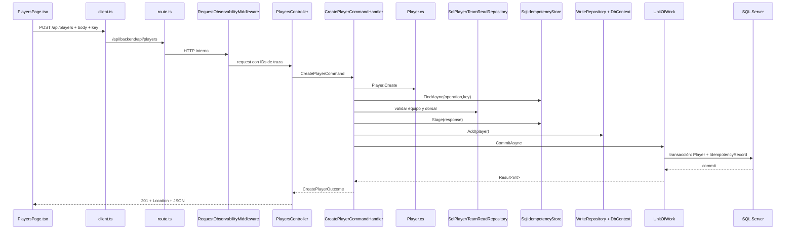

# Guía de interacción entre archivos del Sistema Gestor de Fútbol

## Cómo leer el código paso a paso desde una acción del usuario hasta SQL Server y de regreso

Esta guía explica **el orden real de funcionamiento de los archivos**, no solo su definición aislada. El objetivo es que una persona pueda abrir el proyecto por primera vez, seguir una solicitud completa y comprender por qué interviene cada archivo. Cubre todos los procesos funcionales: equipos, jugadores, partidos, goles, cierre de resultados, posiciones y goleadores; también arranque, base de datos, frontend, observabilidad, Docker y pruebas. Player es un ejemplo detallado, no el eje exclusivo del sistema.

El documento fue generado fuera del repositorio. Las rutas mostradas son relativas a la raíz `DotNetTestMundialRepo`.

---

## 1. La idea principal: el sistema no empieza en la entidad

Una entidad como `Player.cs` no se ejecuta sola. Interviene porque otra pieza la invoca dentro de una solicitud. Hay dos órdenes útiles para estudiar el sistema:

### Orden de construcción

```text
Domain define reglas
    -> Application define casos de uso y puertos
        -> Infrastructure implementa puertos
            -> API compone todo
                -> Frontend consume API
```

### Orden de ejecución de una solicitud

```text
Usuario
  -> página/componente React
  -> apiRequest
  -> proxy Next.js
  -> middleware ASP.NET
  -> controller
  -> Command o Query handler
  -> entidad/puerto
  -> EF Core o Dapper
  -> SQL Server
  -> Result/DTO
  -> respuesta HTTP
  -> estado React
  -> interfaz actualizada
```

El primer orden explica dependencias del código. El segundo explica tiempo de ejecución.

---

## 2. Mapa de proyectos y referencias

```text
DotNetTestMundial.Domain
    no referencia otros proyectos internos

DotNetTestMundial.Application
    -> Domain

DotNetTestMundial.Infrastructure
    -> Application
    -> Domain

DotNetTestMundial.Api
    -> Application
    -> Infrastructure

frontend
    consume API mediante HTTP; no referencia assemblies .NET
```

### Por qué API puede conocer Infrastructure

`Program.cs` es el composition root: el único lugar que debe conocer interfaces y adaptadores para conectarlos. Que API registre Infrastructure no significa que un controller deba ejecutar SQL directamente.

### Proyectos de pruebas

```text
Domain.Tests          -> Domain
Application.Tests     -> Application -> Domain
Infrastructure.Tests  -> Infrastructure -> Application/Domain
Api.Tests             -> Api -> toda la composición
```

Cada proyecto de prueba observa un límite diferente.

---

## 3. El arranque completo del backend

### 3.1 Archivo inicial: `src/DotNetTestMundial.Api/Program.cs`

Este archivo es el punto de entrada del proceso ASP.NET Core. El orden importante es:

1. `WebApplication.CreateBuilder(args)` crea configuración, logging y contenedor DI.
2. Lee `ConnectionStrings:Tournament`.
3. Llama `builder.Services.AddInfrastructure(connectionString)`.
4. Registra cada handler de Application como scoped.
5. Configura controllers, JSON de enums, Swagger y health checks.
6. Construye `app`.
7. Si `Database:ApplyMigrations` es true, resuelve `TournamentDatabaseInitializer`.
8. Agrega `RequestObservabilityMiddleware` al pipeline.
9. Habilita Swagger en Development.
10. Configura redirección HTTPS según configuración.
11. Mapea controllers y `/health`.
12. `app.Run()` inicia el servidor.

`public partial class Program` permite que `Microsoft.AspNetCore.Mvc.Testing` levante el host desde las pruebas de contrato.

### 3.2 Configuración

- `src/DotNetTestMundial.Api/appsettings.json`: valores base, conexión vacía que debe suministrarse externamente, logging y migraciones; la redirección HTTPS usa el valor por defecto del código si no se configura aparte.
- `src/DotNetTestMundial.Api/appsettings.Development.json`: sobreescrituras del ambiente Development.
- `src/DotNetTestMundial.Api/Properties/launchSettings.json`: perfiles locales, puertos y variables para `dotnet run`/IDE.
- `src/DotNetTestMundial.Api/DotNetTestMundial.Api.http`: solicitudes manuales del IDE; no participa en runtime.

La precedencia normal de configuración permite que variables como `ConnectionStrings__Tournament` y `Database__ApplyMigrations` sobrescriban JSON.

### 3.3 `src/DotNetTestMundial.Infrastructure/DependencyInjection.cs`

`AddInfrastructure` registra las implementaciones concretas:

| Puerto/servicio | Implementación | Ciclo |
|---|---|---|
| `TournamentDbContext` | EF SQL Server | Scoped |
| `IWriteRepository<T>` | `WriteRepository<T>` | Scoped |
| `IUnitOfWork` | `UnitOfWork` | Scoped |
| `IIdempotencyStore` | `SqlIdempotencyStore` | Scoped |
| `ITeamReadRepository` | `SqlTeamReadRepository` | Scoped |
| `IPlayerReadRepository` | `SqlPlayerReadRepository` | Scoped |
| `IMatchReadRepository` | `SqlMatchReadRepository` | Scoped |
| `ITournamentReadRepository` | `SqlTournamentReadRepository` | Scoped |
| `IDomainEventDispatcher` | `LoggingDomainEventDispatcher` | Scoped |
| `IPersistenceErrorTranslator` | `SqlServerPersistenceErrorTranslator` | Singleton |

“Scoped” significa una instancia por solicitud HTTP. Repositorio y UnitOfWork comparten el mismo DbContext, condición necesaria para un único commit.

Los repositorios Dapper reciben solo la cadena de conexión: no pueden usar accidentalmente el Change Tracker de EF.

### 3.4 Inicialización de la base

`src/DotNetTestMundial.Infrastructure/Persistence/TournamentDatabaseInitializer.cs`:

1. recibe DbContext y cadena de conexión;
2. ejecuta `MigrateAsync`;
3. abre SqlConnection Dapper;
4. consulta si existe algún equipo;
5. si está vacía, inicia transacción EF;
6. reutiliza las operaciones SQL de `SeedWorldCup2026Tournament`;
7. confirma.

Archivos relacionados:

- `TournamentDbContextFactory.cs`: crea DbContext para herramientas `dotnet ef`; no es el factory usado por cada request.
- `Migrations/*.cs`: instrucciones versionadas para modificar esquema/datos.
- `Migrations/*.Designer.cs`: metadatos generados por EF para cada migración.
- `TournamentDbContextModelSnapshot.cs`: representación actual del modelo usada al generar futuras migraciones.

---

## 4. Infraestructura común de toda escritura

Antes de estudiar Player conviene entender los archivos compartidos.

### 4.1 `Domain/Common/Entity.cs`

Base de `Team`, `Player`, `Match` y `Goal`:

- genera GUID en el constructor;
- expone `Id` con setter protegido;
- mantiene colección privada de eventos;
- permite agregar evento desde una entidad;
- permite limpiar eventos después del commit/rollback.

Una entidad restaurada reemplaza el GUID generado con el ID persistido mediante el setter protegido.

### 4.2 `Domain/Common/Error.cs`

Define un error esperado con código, mensaje y `ErrorType` (`Validation`, `NotFound`, `Conflict`). Los handlers devuelven este dato y los controllers lo convierten a HTTP.

### 4.3 `Domain/Common/Result.cs`

- `Result`: éxito o fallo sin valor.
- `Result<T>`: éxito con valor o fallo con Error.
- `IsSuccess` depende de que Error sea null.
- `Value` solo puede leerse en éxito.

### 4.4 `Domain/Common/DomainErrors.cs`

Catálogo de errores de las entidades: nombre requerido, equipos iguales, minuto inválido, jugador inactivo, marcador incoherente, etc.

### 4.5 Puertos de mensajería

- `Application/Abstractions/Messaging/ICommandHandler.cs`: contrato para casos que intentan cambiar estado.
- `Application/Abstractions/Messaging/IQueryHandler.cs`: contrato para lecturas.

No hay bus interno: los controllers inyectan handlers concretos. Las interfaces expresan forma y sirven de disciplina arquitectónica.

### 4.6 Puertos de persistencia

- `IWriteRepository.cs`: Add/Update/Remove genéricos; no hace commit.
- `IUnitOfWork.cs`: `CommitAsync` y `Rollback`.
- `IIdempotencyStore.cs`: buscar respuesta persistida y preparar una nueva.
- `ITeamReadRepository.cs`, `IPlayerReadRepository.cs`, `IMatchReadRepository.cs`, `ITournamentReadRepository.cs`: lecturas específicas.
- `PersistenceErrors.cs`: errores técnicos traducibles, como restricción o cambio concurrente.

### 4.7 `TournamentDbContext.cs`

- descubre todas las configuraciones EF del assembly;
- bloquea todos los `SaveChanges` públicos;
- expone internamente `SaveFromUnitOfWorkAsync`;
- usa `acceptAllChangesOnSuccess:false` para aceptar estados solo después del commit SQL.

Así un handler no puede saltarse UnitOfWork accidentalmente.

### 4.8 `WriteRepository.cs`

Solo modifica el estado del Change Tracker:

- Add -> Added;
- Update -> Modified;
- Remove -> Deleted.

No abre transacción, no valida negocio y no guarda.

### 4.9 `UnitOfWork.cs`

Orden exacto:

1. obtiene entidades rastreadas;
2. copia eventos pendientes;
3. abre transacción;
4. llama `SaveFromUnitOfWorkAsync`;
5. confirma transacción;
6. llama `ChangeTracker.AcceptAllChanges`;
7. despacha eventos con token seguro;
8. limpia eventos en `finally`.

Ante `DbUpdateException`:

1. rollback;
2. limpia eventos y ChangeTracker;
3. pide traducción a `IPersistenceErrorTranslator`;
4. retorna Result si reconoce la restricción;
5. relanza si es error desconocido.

### 4.10 `SqlServerPersistenceErrorTranslator.cs`

Conecta errores físicos SQL con conceptos de negocio:

- error 51001 -> conflicto de calendario;
- índices Team Name/ShortName -> conflicto de identidad;
- índice dorsal -> dorsal asignado;
- FK/not null/longitud/otros unique -> restricción genérica;
- `DbUpdateConcurrencyException` -> cambio concurrente.

El handler no necesita conocer números de SQL Server.

### 4.11 Plantilla de lectura para cualquier proceso

No todos los archivos aparecen en todas las solicitudes. Para seguir una funcionalidad sin perderse, identifique estas piezas en este orden:

| Paso | Pregunta | Dónde mirar | Qué entrega al siguiente paso |
|---|---|---|---|
| 1. Entrada | ¿Qué acción inició el usuario? | `frontend/src/app/**/page.tsx` y `components/*Page.tsx`, o Swagger/Postman | URL, método, body, filtros y headers |
| 2. Transporte | ¿Cómo sale del navegador? | `frontend/src/lib/api/client.ts` y `app/api/backend/[...path]/route.ts` | Solicitud HTTP a la API |
| 3. Frontera HTTP | ¿Qué endpoint la recibe? | `Api/Controllers/*Controller.cs` | Command/Query con datos de ruta, query, body y headers |
| 4. Caso de uso | ¿Qué se permite hacer? | `Application/{módulo}/**/*Handler.cs`, `*Models.cs`, `*Errors.cs` | `Result` o DTO; llamadas a puertos |
| 5. Reglas | ¿Qué invariantes no se pueden romper? | `Domain/Entities/*.cs`, `DomainErrors.cs`, validators de Application | Entidad válida o error esperado |
| 6. Datos | ¿Es lectura o escritura? | `I*ReadRepository` + `Sql*ReadRepository` para Dapper; `IWriteRepository` + EF + `UnitOfWork` para escritura | DTO consultado o commit confirmado |
| 7. Salida | ¿Cómo vuelve al usuario? | Controller -> proxy -> `apiRequest` -> componente | Código HTTP, cuerpo, aviso/error y recarga |
| 8. Evidencia | ¿Cómo se demuestra? | `tests/**`, `postman/**`, logs, `/health` | Prueba reproducible de la frontera correspondiente |

Para un GET puro, el recorrido se detiene en Dapper: no se restaura una entidad ni se llama `UnitOfWork`. Para una escritura, el handler usa reglas de Domain y confirma mediante UnitOfWork. Para idempotencia, la respuesta almacenada se prepara junto al cambio antes de confirmar. Para agregados como Match/Goal, el handler puede reconstruir varios objetos antes de invocar la regla principal.

### 4.12 Mapa de todos los procesos de negocio

| Proceso | Entrada HTTP | Handler principal | Entidad/regla | Lectura y escritura | Salida visible |
|---|---|---|---|---|---|
| Alta de equipo | `POST /api/teams` | `CreateTeamCommandHandler` | `Team.Create`, identidad única, evento | `SqlTeamReadRepository`, `SqlIdempotencyStore`, EF/UoW | Equipo creado o replay |
| Lista/detalle de equipo | `GET /api/teams[/{id}]` | `GetTeamsQueryHandler` / `GetTeamByIdQueryHandler` | Validación de query | `SqlTeamReadRepository` | Página/detalle |
| Cambio/baja de equipo | `PUT/PATCH/DELETE /api/teams/{id}` | `Update/Patch/DeleteTeamCommandHandler` | `Team.Restore`, `Update` o baja física | Dapper para snapshot/validación; EF/UoW | Recurso actualizado o 204 |
| Alta de jugador | `POST /api/players` | `CreatePlayerCommandHandler` | `Player.Create`, dorsal y equipo | Lecturas Team/Player, idempotencia, EF/UoW | Jugador creado o replay |
| Lista/detalle de jugador | `GET /api/players[/{id}]` | `GetPlayersQueryHandler` / `GetPlayerByIdQueryHandler` | Validación de query | `SqlPlayerReadRepository` | Página/detalle |
| Cambio/baja de jugador | `PUT/PATCH/DELETE /api/players/{id}` | `Update/Patch/DeletePlayerCommandHandler` | `Player.Restore`, `Update`, `Activate/Deactivate` | Dapper para snapshot/dorsal; EF/UoW | Recurso actualizado o 204 |
| Programación de partido | `POST /api/matches` | `CreateMatchCommandHandler` | `Match.Create`, equipos y calendario | Team/Match reads, idempotencia, EF/UoW, trigger SQL | Partido creado o replay |
| Calendario/detalle | `GET /api/matches[/{id}]` | `GetMatchesQueryHandler` / `GetMatchByIdQueryHandler` | Validación de query | `SqlMatchReadRepository` | Página/detalle |
| Reprogramar/cancelar | `PUT/PATCH/DELETE /api/matches/{id}` | `Update/Patch/DeleteMatchCommandHandler` | `Match.Restore`, `Reschedule/Cancel` | Team/Match reads, EF/UoW, trigger SQL | Cambio o 204 |
| Registrar gol | `POST /api/matches/{id}/goals` | `CreateGoalCommandHandler` | `Goal.Create` + `Match.AddGoal` | Player/Match reads, idempotencia, EF/UoW | Gol creado o replay |
| Listar goles | `GET /api/matches/{id}/goals` | `GetMatchGoalsQueryHandler` | Validación de filtros | `SqlMatchReadRepository` | Goles paginados y marcador |
| Cerrar resultado | `PUT /api/matches/{id}/result` | `RegisterMatchResultCommandHandler` | `Match.RegisterResult`, evento | Match+Goal reads, EF/UoW | Partido Played y marcador |
| Posiciones/goleadores | `GET /api/standings`, `/api/scorers` | `GetStandingsQueryHandler`, `GetScorersQueryHandler` | Reglas de cálculo en consulta | `SqlTournamentReadRepository` | Tablas calculadas, sin escritura |

En todas las filas HTTP pasa por `RequestObservabilityMiddleware`; si se inicia desde el frontend, también pasa por `page.tsx`, componente, cliente y proxy. `DependencyInjection.cs` decide qué clase concreta cumple cada interfaz; no es un paso de negocio que se ejecute manualmente en cada handler.

### 4.13 Cómo se encadenan los módulos durante un caso de uso completo

El sistema no es un conjunto de CRUD aislados. Una demostración integral puede seguir esta secuencia:

```text
Team.Create -> equipos persistidos
       ↓ Team.Id
Player.Create -> jugadores ligados a equipos
       ↓ Team.Id
Match.Create -> calendario entre equipos
       ↓ Match.Id + Player.Id
Goal.Create -> goles del partido, asociados a jugador/equipo
       ↓ conjunto de goles persistidos
Match.RegisterResult -> marcador coherente y estado Played
       ↓ consultas SQL sobre partidos Played
Standings + Scorers -> tablas derivadas visibles en frontend
```

Cada flecha es una relación de datos, **no** una llamada directa de una entidad a otra. El usuario o examinador inicia cada operación por HTTP. Los handlers consultan IDs persistidos mediante puertos; Domain valida relaciones; SQL las refuerza con FK, índices y trigger. Al cerrar el partido, `SqlTournamentReadRepository` recalcula posiciones/goleadores al consultar: no hay un archivo que sincronice tablas de clasificación después de cada gol.

Hay tres formas de iniciar el mismo backend: UI Next.js, Swagger/Postman o una prueba HTTP. Solo la primera atraviesa los archivos de frontend. Ejecutar la API en Docker o localmente cambia la configuración/host SQL, **no** el orden controller -> handler -> Domain/puertos -> persistencia.

---

## 5. Player: recorrido completo archivo por archivo

Player ofrece un ejemplo de lectura detallada. Las secciones siguientes aplican la **misma plantilla** a Team, Match, Goal, resultado y consultas del torneo; no dependen de comprender primero Player para poder seguirse.

### 5.1 Vista general



### 5.2 Entidad: `Domain/Entities/Player.cs`

Responsabilidades:

- datos: TeamId, Name, JerseyNumber, IsActive;
- `Create`: valida nuevo jugador y lo activa;
- `Restore`: reconstruye snapshot persistido sin tratarlo como creación;
- `Update`: protege nombre/dorsal;
- `Deactivate` y `Activate`: transición lógica.

No sabe qué es HTTP, SQL, Dapper, DbContext ni React.

Relaciones de código:

- hereda `Entity.cs` para ID/eventos;
- usa `Result.cs` y `DomainErrors.cs`;
- `Goal.Create` recibe Player para copiar PlayerId/TeamId y comprobar actividad;
- `Team.AddPlayer` puede comprobar pertenencia;
- `PlayerConfiguration` decide cómo persistirla.

### 5.3 Mapeo: `Infrastructure/Persistence/Configurations/PlayerConfiguration.cs`

EF lo descubre desde `TournamentDbContext.OnModelCreating`.

Configura:

- tabla Players;
- check `JerseyNumber > 0`;
- identidad común mediante `EntityConfiguration.ConfigureIdentity`;
- longitud máxima del nombre;
- alternate key `(Id, TeamId)` usada por Goal;
- índice TeamId;
- índice único `(TeamId, JerseyNumber)`.

`EntityConfiguration.cs` es una extensión compartida para mapear Id y eventos no persistidos.

### 5.4 Relación Goal-Player

`GoalConfiguration.cs` crea FK compuesta `(PlayerId, TeamId)` hacia `(Player.Id, Player.TeamId)`. Esto impide que un gol guarde un TeamId distinto del equipo persistido del goleador.

`Goal.cs` también valida jugador activo y minuto. `Match.AddGoal` valida que el equipo sea participante. Son capas de protección complementarias.

### 5.5 Contrato de creación

`Application/Players/CreatePlayer/CreatePlayerCommand.cs` contiene:

- `CreatePlayerCommand`: TeamId, Name, JerseyNumber, IdempotencyKey;
- `CreatePlayerOutcome`: PlayerId, StatusCode, ResponseBody, IsReplay.

El Command representa entrada del caso de uso, no el request HTTP. El Outcome conserva exactamente la respuesta idempotente.

### 5.6 `CreatePlayerCommandHandler.cs`

Orden exacto:

1. valida que el Command no sea null;
2. valida Idempotency-Key y longitud;
3. llama `Player.Create`;
4. calcula SHA-256 del payload;
5. busca respuesta previa en `IIdempotencyStore`;
6. si existe, reproduce o retorna conflicto;
7. busca el equipo con `ITeamReadRepository`;
8. usa `PlayerJerseyValidator`;
9. serializa `{ id }`;
10. prepara `IdempotencyRecord`;
11. prepara Player en `IWriteRepository<Player>`;
12. llama UnitOfWork;
13. si una carrera pierde por unique key, busca respuesta ganadora;
14. retorna Outcome o Error.

### 5.7 `PlayerJerseyValidator.cs`

Es un servicio de Application reutilizado en Create, PUT y PATCH. Llama `IPlayerReadRepository.IsJerseyNumberInUseAsync`. En actualización recibe `excludingId` para no considerar al propio jugador.

### 5.8 Puerto y repositorio Dapper

`IPlayerReadRepository.cs` declara:

- `FindByIdAsync`;
- `IsJerseyNumberInUseAsync`;
- `GetPageAsync`.

`SqlPlayerReadRepository.cs` implementa:

- SELECT por ID;
- EXISTS para dorsal;
- COUNT + SELECT paginado mediante QueryMultiple;
- filtros TeamId/IsActive/search;
- columnas de orden elegidas por enum;
- valores como parámetros;
- ID como desempate;
- escape de LIKE.

### 5.9 Idempotencia compartida

`IIdempotencyStore.cs` define `StoredIdempotentResponse`, búsqueda y Stage.

`IdempotencyRecord.cs` es el modelo EF persistido.

`IdempotencyRecordConfiguration.cs` configura clave compuesta y longitudes.

`SqlIdempotencyStore.cs`:

- Find usa Dapper porque es lectura;
- Stage usa el mismo DbContext EF para que respuesta y Player compartan commit.

### 5.10 Controller

`Api/Controllers/PlayersController.cs`:

- define DTOs HTTP internos del controller;
- recibe handlers por constructor;
- convierte body/header/query en Commands/Queries;
- no ejecuta reglas de Player;
- establece Location en POST;
- convierte Result a 200/201/204/400/404/409.

### 5.11 Frontend

`app/jugadores/page.tsx` es la ruta; normalmente importa/renderiza `PlayersPage`.

`components/PlayersPage.tsx`:

1. carga catálogo de equipos;
2. mantiene filtros, página y formulario;
3. crea `path` con `toQuery`;
4. usa `usePagedResource<Player>`;
5. POST si no existe editingId;
6. PATCH si edita;
7. PATCH IsActive para activar/desactivar;
8. conserva Idempotency-Key de un intento;
9. limpia clave al cambiar intención;
10. recarga la página después de éxito.

`hooks/usePagedResource.ts`:

- recibe URL completa;
- llama `apiRequest`;
- mantiene loading/error/result;
- aborta request anterior al cambiar dependencia;
- usa revisión para forzar reload;
- evita mostrar resultado correspondiente a otra requestKey.

`lib/api/client.ts`:

- crea Headers;
- agrega Accept y CorrelationId;
- agrega Content-Type e Idempotency-Key;
- llama `/api/backend`;
- convierte fallos en `ApiClientError`;
- soporta 204;
- `toQuery` omite valores vacíos.

`app/api/backend/[...path]/route.ts`:

- recibe cualquier método del frontend;
- construye URL desde `API_BASE_URL`;
- reenvía body y headers permitidos;
- transmite correlation/trace/idempotency;
- devuelve respuesta sin exponer dirección interna.

`types/api.ts` contiene `Player`, `PagedResult`, errores y otros DTOs TypeScript. Ayuda en compilación, pero la API sigue siendo autoridad runtime.

### 5.12 Lectura paginada de jugadores

```text
PlayersPage
 -> usePagedResource
 -> apiRequest
 -> proxy
 -> GET PlayersController.GetPage
 -> GetPlayersQuery
 -> GetPlayersQueryHandler
 -> valida página y convierte sort strings a enums
 -> PlayerPageSpecification
 -> IPlayerReadRepository
 -> SqlPlayerReadRepository
 -> SQL COUNT + OFFSET/FETCH
 -> PagedResult<PlayerListItem>
 -> HTTP 200
 -> tabla React
```

Archivos:

- `GetPlayersQuery.cs`: query, DTO, enums, specification;
- `GetPlayersErrors.cs`: validaciones de entrada;
- `GetPlayersQueryHandler.cs`: normaliza y delega;
- `Common/PagedResult.cs`: calcula TotalPages;
- `GetPlayerByIdQueryHandler.cs`: lectura individual y 404.

### 5.13 PUT, PATCH y DELETE Player

`PlayerMutationModels.cs`: Commands, respuesta y errores compartidos.

`UpdatePlayerCommandHandler.cs`:

1. lee snapshot Dapper;
2. 404 si no existe;
3. `Player.Restore`;
4. `Player.Update`;
5. valida dorsal excluyendo ID;
6. `writes.Update`;
7. UnitOfWork;
8. proyecta respuesta.

`PatchPlayerCommandHandler.cs`: mismo patrón, pero mezcla campos omitidos con snapshot y puede activar/desactivar.

`DeletePlayerCommandHandler.cs`:

- 404 si no existe;
- éxito inmediato si ya está inactivo;
- Restore -> Deactivate -> Update -> Commit;
- controller devuelve 204.

---

## 6. Team: archivos y flujos

**Ruta completa de escritura.** `frontend/src/app/equipos/page.tsx` monta `TeamsPage.tsx`; el formulario llama `apiRequest`, que pasa por el proxy `route.ts`; el middleware añade identificadores; `TeamsController` construye un Command; el handler coordina Domain, consultas de unicidad, idempotencia y EF; `UnitOfWork` confirma; la respuesta vuelve por controller, proxy y componente. Si se usa Swagger, se omiten únicamente las piezas frontend/proxy: el resto es idéntico.

### 6.1 Entidad

`Domain/Entities/Team.cs`:

- Name y ShortName;
- lista privada de Players;
- Create valida/normaliza y agrega `TeamCreatedEvent`;
- Restore hidrata sin evento;
- Update reutiliza invariantes;
- AddPlayer valida pertenencia.

`TeamCreatedEvent.cs` implementa `IDomainEvent.cs` y contiene TeamId, nombre y OccurredAt.

### 6.2 Persistencia

`TeamConfiguration.cs` configura tabla, longitudes, relaciones e índices únicos.

`SqlTeamReadRepository.cs` implementa detalle, página y comprobaciones de nombre/abreviatura.

`ITeamReadRepository.cs` es el puerto que desacopla handlers del SQL.

### 6.3 Creación

```text
TeamsPage.tsx
 -> POST /api/teams
 -> TeamsController.Create
 -> CreateTeamCommand
 -> CreateTeamCommandHandler
 -> Team.Create (agrega evento)
 -> SqlIdempotencyStore.Find
 -> TeamIdentityValidator
 -> Stage respuesta + WriteRepository.Add(team)
 -> UnitOfWork commit
 -> LoggingDomainEventDispatcher
 -> 201/replay
```

Archivos:

- `Teams/CreateTeam/CreateTeamCommand.cs`: contrato y Outcome;
- `CreateTeamCommandHandler.cs`: idempotencia/orquestación;
- `IdempotencyErrors.cs`: clave requerida/larga/reutilizada;
- `Mutations/TeamIdentityValidator.cs`: nombre y abreviatura;
- `Api/Controllers/TeamsController.cs`: adaptación REST;
- `frontend/components/TeamsPage.tsx`: UI, filtros y formulario.

### 6.4 Consultas

- `GetTeamsQuery.cs`: filtros, DTO y enums;
- `GetTeamsErrors.cs`: parámetros inválidos;
- `GetTeamsQueryHandler.cs`: convierte texto a specification;
- `GetTeamByIdQueryHandler.cs`: detalle;
- `SqlTeamReadRepository.cs`: SQL.

Orden de `GET /api/teams`: `TeamsPage` cambia filtro/página -> `usePagedResource` -> `TeamsController.GetPage` -> `GetTeamsQuery` -> handler valida y produce specification -> `ITeamReadRepository.GetPageAsync` -> Dapper cuenta y pagina -> `PagedResult<TeamListItem>` -> tabla. `GET /api/teams/{id}` sustituye el handler por `GetTeamByIdQueryHandler` y retorna detalle o 404; no pasa por EF ni UnitOfWork. `Common/PagedResult.cs` calcula los metadatos que `Pagination` muestra.

### 6.5 Mutaciones

- `TeamMutationModels.cs`: Commands/resultados/errores;
- `UpdateTeamCommandHandler.cs`: reemplazo de campos editables;
- `PatchTeamCommandHandler.cs`: combinación snapshot + campos presentes;
- `DeleteTeamCommandHandler.cs`: reconstruye y Remove; FK puede convertirse a 409.

El patrón Restore -> método Domain -> WriteRepository -> UnitOfWork es equivalente al de Player.

Secuencia concreta de cada mutación:

| Operación | Archivos que deciden el cambio | Persistencia y respuesta |
|---|---|---|
| `PUT /api/teams/{id}` | `TeamsController` -> `TeamMutationModels` -> `UpdateTeamCommandHandler` -> `SqlTeamReadRepository.FindByIdAsync` -> `Team.Restore`/`Update` -> `TeamIdentityValidator` | `WriteRepository<Team>.Update` -> `UnitOfWork` -> 200 o error |
| `PATCH /api/teams/{id}` | `TeamsController` -> `PatchTeamCommandHandler`; los campos omitidos conservan valores del snapshot; `Team.Update` valida el estado final | Igual que PUT; el patch no salta las reglas de Domain |
| `DELETE /api/teams/{id}` | `TeamsController` -> `DeleteTeamCommandHandler` -> snapshot Dapper -> `Team.Restore` | `WriteRepository<Team>.Remove` -> `UnitOfWork` -> 204; las FK pueden producir 409 |

En la interfaz, `TeamsPage.tsx` vuelve a cargar la lista tras una escritura. `types/api.ts` describe `Team` y su página; `components/ui.tsx` aporta tabla/estados visuales. `TeamTests`, `TeamMutationCommandHandlerTests`, `GetTeamsQueryHandlerTests`, `SqlServerTournamentTests` y `ApiContractTests` comprueban distintos límites del mismo recorrido.

---

## 7. Match: calendario, estados y mutaciones

**Ruta completa de calendario.** `app/partidos/page.tsx` -> `MatchesPage.tsx` -> cliente/proxy -> `MatchesController` -> handler `Matches/*` -> `Match.cs` y validadores de Application -> repositorios de lectura Dapper + escritura EF -> `UnitOfWork` -> SQL Server -> respuesta y recarga. A diferencia de Team, aquí importa el estado `Scheduled/Played/Cancelled` y la restricción de programación concurrente.

### 7.1 Entidad

`Domain/Entities/Match.cs` contiene:

- HomeTeamId, AwayTeamId, ScheduledAt;
- Status (`Scheduled`, `Played`, `Cancelled`);
- HomeScore/AwayScore;
- colección privada de Goal;
- Create, Restore, Reschedule, AddGoal, RegisterResult, Cancel.

`Domain/Enums/MatchStatus.cs` define los estados persistidos y serializados por nombre en HTTP.

`MatchResultRegistered.cs` define el evento emitido al cerrar un resultado.

### 7.2 Configuración EF

`MatchConfiguration.cs` configura:

- relaciones con equipos local/visitante;
- estados y marcadores;
- índices;
- comportamiento frente al trigger;
- navegación/relación con goles según modelo.

`GoalConfiguration.cs` configura Goal y FK compuesta al jugador/equipo.

### 7.3 Creación de partido

```text
MatchesPage -> POST
 -> MatchesController.Create
 -> CreateMatchCommandHandler
 -> Match.Create
 -> IdempotencyStore.Find
 -> MatchTeamValidator (equipos existen/distintos)
 -> IMatchReadRepository.HasTeamScheduleConflict
 -> Stage + WriteRepository.Add
 -> UnitOfWork
 -> trigger SQL como defensa concurrente
 -> 201/replay/409
```

Archivos:

- `Matches/CreateMatch/CreateMatchCommand.cs`;
- `CreateMatchCommandHandler.cs`;
- `Mutations/MatchTeamValidator.cs`;
- `IMatchReadRepository.cs`;
- `SqlMatchReadRepository.cs`;
- `MatchesController.cs`;
- `frontend/components/MatchesPage.tsx`.

### 7.4 Consulta de calendario

- `GetMatchesQuery.cs`: filtros team/status/from/to, DTO, enums y specification;
- `GetMatchesErrors.cs`: errores;
- `GetMatchesQueryHandler.cs`: valida y transforma;
- `GetMatchByIdQueryHandler.cs`: detalle;
- `SqlMatchReadRepository.GetPageAsync`: count, joins, filtros y página;
- `MatchesPage.tsx`: filtros y tabla;
- `app/partidos/page.tsx`: ruta.

En `GET /api/matches`, el controller convierte query strings en `GetMatchesQuery`; `GetMatchesQueryHandler` valida fechas, filtros, página y orden, después pide `IMatchReadRepository.GetPageAsync`. `SqlMatchReadRepository` proyecta nombres de equipos y estado sin restaurar `Match`. `GetMatchByIdQueryHandler` hace lo mismo para un ID y puede producir 404. El frontend recibe `PagedResult<MatchListItem>` y muestra `Pagination`; no realiza una segunda consulta EF por cada fila.

### 7.5 PUT/PATCH/DELETE

- `MatchMutationModels.cs`: contratos y errores;
- `UpdateMatchCommandHandler.cs`: snapshot, Restore, validaciones, Reschedule, commit;
- `PatchMatchCommandHandler.cs`: conserva campos omitidos;
- `DeleteMatchCommandHandler.cs`: Cancel; si ya Cancelled es efecto repetible; Played produce conflicto.

Los handlers consultan el día mediante Dapper. La migración `PreventSameDayMatchesAndSupportTriggers` agrega el trigger que protege carreras en SQL.

Detalle por operación:

| Operación | Camino de archivos | Regla diferenciadora |
|---|---|---|
| POST | `MatchesController` -> `CreateMatchCommand` -> `CreateMatchCommandHandler` -> `Match.Create` -> `MatchTeamValidator` -> `IMatchReadRepository` -> `SqlIdempotencyStore` -> `WriteRepository<Match>` -> `UnitOfWork` | Equipos distintos/existentes y día libre; el trigger SQL protege solicitudes concurrentes |
| PUT | `MatchesController` -> `MatchMutationModels` -> `UpdateMatchCommandHandler` -> snapshot Dapper -> `Match.Restore`/`Reschedule` -> validador -> EF/UoW | Reemplaza los campos editables del calendario, respetando estado |
| PATCH | `MatchesController` -> `PatchMatchCommandHandler` -> snapshot Dapper -> `Match.Restore`/`Reschedule` -> EF/UoW | Conserva valores omitidos; no evita conflictos de día |
| DELETE | `MatchesController` -> `DeleteMatchCommandHandler` -> snapshot Dapper -> `Match.Cancel` -> EF/UoW | Es cancelación lógica; repetirla si ya está Cancelled es exitoso; un partido Played no se cancela |

`MatchConfiguration.cs` y la migración de trigger expresan integridad en base. `MatchTests.cs`, `CreateMatchCommandHandlerTests.cs`, `MatchMutationCommandHandlerTests.cs`, `GetMatchesQueryHandlerTests.cs`, `MatchScheduleMigrationTests.cs` y pruebas SQL/API aportan evidencia en cada frontera.

---

## 8. Goal y resultado: la interacción más rica

`Goal` no tiene controller independiente: los endpoints están anidados en `MatchesController`. La UI que los inicia es `app/partidos/[id]/page.tsx` -> `MatchDetailPage.tsx`. Registrar goles y cerrar marcador son **dos procesos distintos**: el primero agrega registros Goal, el segundo valida esos registros y cambia el estado del Match.

### 8.1 Crear gol

Archivos principales:

- `Results/CreateGoalCommand.cs`;
- `CreateGoalCommandHandler.cs`;
- `Domain/Entities/Goal.cs`;
- `Domain/Entities/Match.cs`;
- `IPlayerReadRepository`;
- `IMatchReadRepository`;
- `WriteRepository<Goal>`;
- `SqlIdempotencyStore`;
- `MatchesController.CreateGoal`;
- `MatchDetailPage.tsx`.

Orden:

1. UI selecciona jugador/minuto y conserva key.
2. Controller crea Command con MatchId de ruta.
3. Handler valida key.
4. Lee partido y jugador con Dapper.
5. Restaura Player y Match.
6. `Goal.Create` valida match ID, jugador activo y minuto.
7. `Match.AddGoal` valida partido Scheduled, MatchId, equipo participante y no duplicación.
8. Prepara respuesta idempotente y Goal con EF.
9. UnitOfWork confirma ambos.
10. Controller retorna 201.

La respuesta vuelve a `MatchDetailPage.tsx` por proxy/cliente; el componente recarga goles y detalle. `GoalConfiguration.cs` persiste la relación con jugador, equipo y partido; `SqlServerPersistenceErrorTranslator.cs` convierte fallos de integridad conocidos si una carrera alcanza la base. `MatchResultCommandHandlerTests.cs` contiene las pruebas de `CreateGoalCommandHandler`; `GoalTests.cs`/`MatchTests.cs` prueban reglas sin HTTP.

### 8.2 Consultar goles

`GetMatchGoalsQueryHandler.cs` valida página, equipo, search, sortBy y dirección. Primero encuentra el partido para conocer IDs confiables de local/visitante y luego crea `GoalPageSpecification`.

`MatchResultModels.cs` contiene:

- DTO `GoalListItem`;
- campos seguros de orden;
- specification;
- `MatchGoalsPage` con datos/página/totales/marcador;
- Commands/resultados del cierre.

`SqlMatchReadRepository.GetGoalsAsync` usa tres result sets:

1. count de goles filtrados;
2. marcador completo local/visitante sin filtros de página;
3. filas filtradas/ordenadas/paginadas.

`MatchDetailPage.tsx` muestra `goalPage.data`, pero usa `homeGoals/awayGoals` para el marcador. Un contador `loadSequence` ignora respuestas antiguas.

### 8.3 Registrar resultado

`RegisterMatchResultCommandHandler.cs`:

1. llama `FindStateByIdAsync`;
2. obtiene Match DTO + colección completa de goles en el mismo comando Dapper;
3. restaura Match;
4. restaura y agrega cada Goal al agregado;
5. llama `Match.RegisterResult(homeScore, awayScore)`;
6. Domain compara conteos;
7. cambia a Played y agrega evento;
8. EF marca Match Modified;
9. UnitOfWork confirma;
10. dispatcher registra evento;
11. API devuelve 200.

No se escribe directamente la clasificación. Las estadísticas se derivan al consultar partidos Played.

El contrato de entrada/salida está en `MatchResultModels.cs`; el controller traduce su `Result` a HTTP. Un resultado incoherente con los goles retorna un error esperado antes del commit. Tras uno válido, `MatchResultRegistered` pasa por `UnitOfWork` a `LoggingDomainEventDispatcher`. `MatchResultCommandHandlerTests.cs` verifica la orquestación; `SqlServerTournamentTests.cs` y las consultas del torneo verifican el efecto en lecturas derivadas.

---

## 9. Posiciones y goleadores

Estos recorridos son intencionalmente diferentes de las escrituras: parten de partidos ya cerrados, calculan proyecciones SQL y **no** ejecutan `Match.RegisterResult`, `WriteRepository`, idempotencia ni `UnitOfWork`. El examinador puede comprobar que al cerrar un partido cambian ambas tablas sin actualizar manualmente tablas de estadísticas.

### 9.1 API y Application

`Api/Controllers/TournamentController.cs` expone `/api/standings` y `/api/scorers`.

`Application/Tournament/Queries/TournamentQueryModels.cs` contiene queries, DTOs, enums y specifications.

`TournamentQueryErrors.cs` centraliza entradas inválidas.

`GetStandingsQueryHandler.cs` y `GetScorersQueryHandler.cs`:

- validan página/tamaño;
- convierten sortBy/direction a enums;
- validan teamId en goleadores;
- normalizan búsqueda;
- delegan a `ITournamentReadRepository`.

### 9.2 Infrastructure

`SqlTournamentReadRepository.cs`:

- standings: CTE MatchSides + TeamStats + Ranked;
- incluye equipos sin partidos con LEFT JOIN;
- solo usa MatchStatus.Played;
- calcula PJ/PG/PE/PP/GF/GC/DG/puntos;
- aplica desempates;
- cuenta y pagina;
- scorers: joins Goal/Match/Player/Team;
- agrupa solo goles de Played.

### 9.3 Frontend

- `app/posiciones/page.tsx` -> `StandingsPage.tsx`;
- `app/goleadores/page.tsx` -> `ScorersPage.tsx`;
- ambos construyen filtros, usan `usePagedResource`, muestran tabla y Pagination;
- no recalculan reglas en JavaScript.

Recorrido de `/api/standings`: `posiciones/page.tsx` -> `StandingsPage.tsx` -> `usePagedResource`/`apiRequest`/proxy -> `TournamentController.GetStandings` -> `GetStandingsQueryHandler` -> `ITournamentReadRepository` -> `SqlTournamentReadRepository` -> SQL que agrega solo partidos Played -> `PagedResult<StandingListItem>` -> tabla.

Recorrido de `/api/scorers`: `goleadores/page.tsx` -> `ScorersPage.tsx` -> cliente/proxy -> `TournamentController.GetScorers` -> `GetScorersQueryHandler` -> mismo puerto/repositorio Dapper, con agrupación de goles de partidos Played -> `PagedResult<ScorerListItem>` -> tabla. `TournamentQueryHandlerTests.cs` valida filtros/orden; `SqlServerTournamentTests.cs` contrasta consultas con SQL real; `ApiContractTests.cs` verifica la frontera HTTP.

---

## 10. Observabilidad alrededor de todos los flujos

### 10.1 `RequestObservabilityMiddleware.cs`

Este middleware envuelve todo lo posterior:

1. resuelve/genera CorrelationId;
2. lo asigna a `HttpContext.TraceIdentifier`;
3. usa Activity ASP.NET o fallback W3C;
4. obtiene TraceId;
5. escribe ambos headers de respuesta;
6. abre scope de logging;
7. log Debug de inicio;
8. cronometra `next(context)`;
9. log Error si excepción y relanza;
10. log final Information/Warning/Error según status.

Por estar antes de controllers, incluye health, Swagger y endpoints.

### 10.2 `CorrelationIdHeaderOperationFilter.cs`

Agrega X-Correlation-ID a la documentación Swagger/OpenAPI. No implementa runtime; solo describe el header para usuarios de Swagger.

### 10.3 Eventos

- `IDomainEvent.cs`: contrato con fecha.
- `IDomainEventDispatcher.cs`: puerto Application.
- `TeamCreatedEvent.cs`, `MatchResultRegistered.cs`: hechos.
- `LoggingDomainEventDispatcher.cs`: adaptador que serializa campos y TraceId.
- `UnitOfWork.cs`: decide el momento posterior al commit.

El middleware aporta scope, por lo que el dispatcher hereda CorrelationId/TraceId durante la solicitud.

---

## 11. Frontend: orden de archivos

### 11.1 Entrada global

- `app/layout.tsx`: HTML raíz, metadatos y navegación/layout compartido.
- `app/globals.css`: estilos globales; no participa en lógica de negocio.
- `app/page.tsx`: portada.
- `app/favicon.ico`: recurso visual.

### 11.2 Páginas de ruta

Los `page.tsx` conectan URL con componente:

| URL | Archivo de ruta | Componente funcional |
|---|---|---|
| `/equipos` | `app/equipos/page.tsx` | `TeamsPage.tsx` |
| `/jugadores` | `app/jugadores/page.tsx` | `PlayersPage.tsx` |
| `/partidos` | `app/partidos/page.tsx` | `MatchesPage.tsx` |
| `/partidos/[id]` | `app/partidos/[id]/page.tsx` | `MatchDetailPage.tsx` |
| `/posiciones` | `app/posiciones/page.tsx` | `StandingsPage.tsx` |
| `/goleadores` | `app/goleadores/page.tsx` | `ScorersPage.tsx` |

Las páginas pueden ser Server Components; los componentes interactivos tienen `"use client"`.

### 11.3 Componentes comunes

`components/ui.tsx` contiene:

- PageHeader;
- LoadingState;
- EmptyState;
- ErrorNotice;
- Pagination;
- StatusBadge y utilidades visuales.

Evita repetir renderizado de estados, pero no incorpora reglas de backend.

### 11.4 Cliente y tipos

- `types/api.ts`: forma esperada de recursos, páginas y errores;
- `lib/api/client.ts`: transporte y normalización de errores;
- `hooks/usePagedResource.ts`: ciclo de lecturas paginadas;
- `app/api/backend/[...path]/route.ts`: proxy servidor-a-servidor.

Orden de una lectura UI:

```text
page.tsx -> Component -> usePagedResource -> apiRequest
 -> Route Handler proxy -> API -> respuesta
 -> ApiClientError o DTO -> hook -> render
```

Orden de una mutación UI:

```text
submit/click -> Component -> apiRequest(options)
 -> proxy -> API -> handler -> DB
 -> éxito/error -> notice/ErrorNotice -> reload
```

---

## 12. Docker y archivos de operación

### 12.1 `Dockerfile` raíz

Compila/publica la API en etapas y produce imagen runtime. El contenedor ejecuta el assembly ASP.NET.

### 12.2 `frontend/Dockerfile`

Instala dependencias, compila Next standalone y copia salida mínima a runtime Node.

### 12.3 `docker-compose.yml`

Orden lógico:

1. SQL Server inicia y healthcheck ejecuta SELECT 1.
2. API depende de SQL healthy, recibe connection string y aplica migraciones/seed.
3. API healthcheck consulta `/health`.
4. Frontend depende de API healthy y usa `http://api:8080`.
5. navegador entra por puerto frontend del host.

El volumen conserva SQL después de recrear contenedores.

### 12.4 Variables

- `.env.docker.example`: plantilla versionada.
- `.env` / `.env.docker`: configuración local ignorada.
- `scripts/Start-Qa.ps1`: prepara `.env`, valida Compose, build/up/wait y muestra servicios.
- `scripts/Test-Qa.ps1`: health, restore, format, tests/TRX, frontend, Newman y diff check.

### 12.5 CI

`.github/workflows/qa.yml` reproduce el proceso en GitHub Actions. No se carga por el runtime de la API; es automatización del repositorio.

---

## 13. Migraciones: orden y efecto

Las migraciones se aplican en orden de timestamp:

1. `20260903052237_InitialPersistence.cs`: tablas base Team/Player/Match/Goal y relaciones.
2. `20260907002149_AddIdempotencyRecords.cs`: tabla de replay.
3. `20260910025546_SeedWorldCup2026Tournament.cs`: cuatro equipos, veinte jugadores, seis partidos y tres resultados.
4. `20260913002107_EnforceQaBusinessRules.cs`: índices/constraints adicionales.
5. `20260913025558_PreventSameDayMatchesAndSupportTriggers.cs`: regla por día y trigger.

Los `.Designer.cs` no deben editarse manualmente salvo conocimiento específico. Snapshot representa resultado acumulado, no una migración ejecutable por sí sola.

---

## 14. Cómo los tests se conectan a los archivos productivos

### 14.1 Domain.Tests

- `TeamTests.cs` -> `Team.cs`;
- `PlayerTests.cs` -> `Player.cs`;
- `MatchTests.cs` -> `Match.cs` y `Goal.cs`;
- `GoalTests.cs` -> `Goal.cs`/Player;
- `ResultTests.cs` -> `Result.cs`.

No levantan API ni SQL; comprueban reglas directamente.

### 14.2 Application.Tests

Agrupados por Teams/Players/Matches/Tournament. Instancian handlers con dobles de puertos para comprobar:

- validación previa;
- llamadas al UnitOfWork;
- replay/conflictos;
- specifications paginadas;
- mapping de resultados.

Ejemplo: `Players/CreatePlayerCommandHandlerTests.cs` se conecta conceptualmente a Command, handler, entidad, validators y puertos, pero sustituye adaptadores SQL.

### 14.3 Infrastructure.Tests

- `SqliteTestDatabase.cs`: DbContext aislado;
- `PersistenceUnitTests.cs`: configuración/repositorio;
- `UnitOfWorkIntegrationTests.cs`: commit/rollback/eventos;
- `RecordingDomainEventDispatcher.cs`: captura eventos;
- `WorldCup2026SeedMigrationTests.cs`: contenido SQL del seed;
- `MatchScheduleMigrationTests.cs`: regla/trigger;
- `SqlServerTournamentTests.cs`: SQL Server real, EF write y Dapper read.

### 14.4 Api.Tests

- `ApiContractTests.cs`: host `Program`, `/health`, Swagger, headers y operaciones;
- `RequestObservabilityMiddlewareTests.cs`: middleware aislado, scopes/niveles/trazas.

`Microsoft.AspNetCore.Mvc.Testing` usa `public partial Program` para construir el servidor de prueba.

---

## 15. Índice funcional: “si cambio X, qué archivos reviso”

### Agregar campo editable a cualquier recurso

Revisar, en orden, sustituyendo `X` por Team, Player o Match según corresponda:

1. `X.cs`: regla y estado; para gol también revise el agregado `Match.cs`.
2. `XConfiguration.cs`: columna/longitud/constraint.
3. nueva migración + snapshot.
4. DTOs Commands/Query en Application.
5. `XListItem` y specifications si se filtra/ordena.
6. handlers Create/Update/Patch.
7. hash idempotente de Create.
8. SQL de `SqlXReadRepository`.
9. request DTO de `XController` (para Goal, `MatchesController`).
10. `frontend/types/api.ts`.
11. componente `frontend/components/*Page.tsx` correspondiente.
12. Postman.
13. tests Domain/Application/Infrastructure/API.

No todos los recursos admiten las mismas operaciones: Goal se crea/lista dentro de Match; posiciones y goleadores son proyecciones, no entidades editables. Si el campo afecta clasificación o goles, revise además `SqlTournamentReadRepository.cs` y las pruebas de cálculo.

### Agregar un nuevo endpoint de colección

1. Query/DTO/specification/errors.
2. interfaz de lectura.
3. Query handler.
4. implementación Dapper.
5. registro DI si es nuevo repositorio.
6. controller.
7. tipos frontend.
8. página/componente/hook.
9. Swagger contract test.
10. Postman y tests.

### Agregar una mutación

1. método o regla Domain;
2. Command/result/errors;
3. puertos necesarios;
4. handler;
5. repositorio EF + UnitOfWork;
6. traducción SQL si hay nueva restricción;
7. controller;
8. frontend;
9. pruebas.

### Agregar evento

1. clase que implementa `IDomainEvent`;
2. entidad agrega evento tras transición válida;
3. UnitOfWork ya lo captura;
4. dispatcher debe poder loggearlo;
5. tests de evento/commit;
6. documentación de observabilidad.

---

## 16. Árbol de responsabilidades por archivo

### Domain

| Archivo/grupo | Papel |
|---|---|
| `Common/Entity.cs` | identidad y eventos |
| `Common/Result.cs` | resultado esperado |
| `Common/Error.cs` | código/mensaje/tipo |
| `Common/DomainErrors.cs` | catálogo de invariantes |
| `Common/IDomainEvent.cs` | contrato de evento |
| `Entities/Team.cs` | reglas de equipo |
| `Entities/Player.cs` | reglas de jugador |
| `Entities/Match.cs` | agregado partido |
| `Entities/Goal.cs` | creación/restauración de gol |
| `Enums/MatchStatus.cs` | estados de partido |
| `Events/*.cs` | hechos de dominio |

### Application

| Grupo | Papel |
|---|---|
| `Abstractions/Messaging` | forma de handlers |
| `Abstractions/Persistence` | puertos read/write/UoW/idempotencia |
| `Abstractions/Events` | puerto dispatcher |
| `Common/PagedResult.cs` | sobre paginado |
| `Teams/CreateTeam` | creación idempotente |
| `Teams/GetTeams` | lista/detalle |
| `Teams/Mutations` | PUT/PATCH/DELETE |
| `Players/CreatePlayer` | creación idempotente |
| `Players/GetPlayers` | lista/detalle |
| `Players/Mutations` | PUT/PATCH/baja |
| `Matches/CreateMatch` | programación idempotente |
| `Matches/GetMatches` | calendario/detalle |
| `Matches/Mutations` | reprogramar/cancelar |
| `Matches/Results` | goles/listado/resultado |
| `Tournament/Queries` | posiciones/goleadores |

### Infrastructure

| Grupo | Papel |
|---|---|
| `DependencyInjection.cs` | conectar puertos/adaptadores |
| `Persistence/TournamentDbContext.cs` | sesión EF write |
| `Repositories/WriteRepository.cs` | preparar estados EF |
| `Persistence/UnitOfWork.cs` | transacción/commit/eventos |
| `Configurations/*.cs` | mapeo/constraints EF |
| `Queries/*.cs` | Dapper read side |
| `Idempotency/*.cs` | replay persistido |
| `SqlServerPersistenceErrorTranslator.cs` | SQL -> Error |
| `Migrations/*` | evolución de esquema/seed |
| `TournamentDatabaseInitializer.cs` | bootstrap |
| `Observability/LoggingDomainEventDispatcher.cs` | log de eventos |

### API

| Archivo | Papel |
|---|---|
| `Program.cs` | entrada y composición |
| `Controllers/TeamsController.cs` | HTTP equipos |
| `Controllers/PlayersController.cs` | HTTP jugadores |
| `Controllers/MatchesController.cs` | HTTP partidos/goles |
| `Controllers/TournamentController.cs` | HTTP estadísticas |
| `RequestObservabilityMiddleware.cs` | envoltura de trazas/logs |
| `CorrelationIdHeaderOperationFilter.cs` | documentación Swagger |
| `appsettings*.json` | configuración |

### Frontend

| Archivo/grupo | Papel |
|---|---|
| `app/**/page.tsx` | rutas |
| `components/*Page.tsx` | funcionalidad por módulo |
| `components/ui.tsx` | UI común |
| `hooks/usePagedResource.ts` | carga paginada |
| `lib/api/client.ts` | transporte/error/headers |
| `types/api.ts` | contratos TypeScript |
| `app/api/backend/[...path]/route.ts` | proxy a API |
| `globals.css` | presentación |

---

## 17. Orden recomendado para estudiar el repositorio

### Primera pasada: arquitectura

1. `.sln` y los `.csproj`.
2. `Program.cs`.
3. `DependencyInjection.cs`.
4. interfaces en `Application/Abstractions`.
5. `Entity`, `Result`, `Error`.

### Segunda pasada: un módulo sencillo

1. `Team.cs`.
2. `CreateTeamCommand` y handler.
3. `ITeamReadRepository` / `SqlTeamReadRepository`.
4. `TeamConfiguration`.
5. `TeamsController`.
6. `TeamsPage`.

### Tercera pasada: todos los recorridos CRUD

Repita el mismo orden para **Team, Player y Match**: entidad -> configuración EF -> Command/Query/handler -> puerto -> implementación Dapper/EF -> controller -> componente frontend -> pruebas. Compare específicamente cómo se comportan sus tres DELETE: físico, desactivación y cancelación. Las secciones 5, 6 y 7 contienen los archivos de cada recorrido.

### Cuarta pasada: agregado complejo

1. `Match.cs` y `Goal.cs`.
2. CreateGoal handler.
3. RegisterMatchResult handler.
4. SqlMatchReadRepository.
5. MatchDetailPage.

### Quinta pasada: infraestructura transversal

1. DbContext/configurations.
2. WriteRepository.
3. UnitOfWork.
4. error translator.
5. idempotency.
6. middleware/event dispatcher.
7. migrations/initializer.

### Sexta pasada: evidencia

1. test Domain de una regla;
2. test Application del handler;
3. test Infrastructure del commit;
4. test SQL de clasificación;
5. test API del contrato;
6. colección Postman.

---

## 18. Cómo depurar una solicitud

### Si un POST/PUT/PATCH retorna 400

1. Observe Error code en frontend/client.
2. Revise request DTO del controller correspondiente (`Teams`, `Players` o `Matches`).
3. Siga el Command y handler hasta `Team`, `Player`, `Match` o `Goal`.
4. Compare con `DomainErrors`.
5. 400 suele ocurrir antes de abrir transacción.

### Si retorna 404

1. Identifique qué recurso buscó el handler: Team, Player, Match o Goal.
2. Revise el puerto `I*ReadRepository`, su `Sql*ReadRepository`, la cadena de conexión y el ID enviado.
3. En creación de gol, distinga partido inexistente de jugador inexistente; en resultado, partido inexistente.

### Si retorna 409

Puede provenir de dos momentos: validación previa en Application/Domain o restricción SQL detectada durante `UnitOfWork`. Ejemplos:

- Team: `TeamIdentityValidator` o índices de nombre/abreviatura; borrar un equipo referenciado puede chocar con FK.
- Player: `PlayerJerseyValidator` o índice `(TeamId, JerseyNumber)`.
- Match: `MatchTeamValidator` o trigger de calendario; un estado Played impide cancelación.
- Goal/resultado: gol inválido para el partido o marcador que no coincide con goles registrados.
- Idempotencia: reutilizar la misma clave para un payload diferente.

`SqlServerPersistenceErrorTranslator` permite que varias de esas fallas físicas se expresen como error de negocio, pero no reemplaza las validaciones previas ni garantiza que todo 409 provenga de SQL.

### Si retorna 500

1. busque CorrelationId/TraceId en respuesta;
2. revise log middleware Error;
3. identifique stack/Category;
4. si ocurrió en UnitOfWork, confirme rollback;
5. no convierta automáticamente a Conflict.

### Si la UI muestra datos antiguos

1. revise URL construida con `toQuery`;
2. revise `requestKey`/revision en hook;
3. confirme respuesta proxy;
4. confirme página/totales en API;
5. en MatchDetail revise `loadSequence`.

---

## 19. Matriz rápida de conexiones

| Elemento | Es invocado por | Invoca a |
|---|---|---|
| `Team.Create/Restore/Update` | handlers Team/tests | Result, DomainErrors, TeamCreatedEvent |
| `Player.Create` | CreatePlayer handler/tests | Result/DomainErrors |
| `Player.Restore` | mutation/result handlers | constructor interno |
| `Match.Create/Restore/Reschedule/Cancel/RegisterResult` | handlers Match/tests | Goal, MatchStatus, Result/evento |
| `Goal.Create/Restore` | CreateGoal/resultado handlers/tests | Player, Result/DomainErrors |
| `*Configuration` | DbContext al construir modelo | EF metadata, índices/FK/constraints |
| `CreateTeam/CreateMatch/CreateGoalCommandHandler` | controllers/tests | Domain, reads, idempotencia, writes, UoW |
| `CreatePlayerCommandHandler` | PlayersController/tests | Domain, reads, idempotency, write, UoW |
| `GetTeams/GetMatches/GetMatchGoalsQueryHandler` | controllers/tests | puertos de lectura correspondientes |
| `GetPlayersQueryHandler` | PlayersController/tests | IPlayerReadRepository |
| `GetStandings/GetScorersQueryHandler` | TournamentController/tests | ITournamentReadRepository |
| `SqlTeam/SqlMatch/SqlTournamentReadRepository` | DI mediante puertos | SqlConnection/Dapper |
| `SqlPlayerReadRepository` | DI mediante puerto | SqlConnection/Dapper |
| `WriteRepository<T>` | handlers mediante interfaz | DbContext ChangeTracker |
| `UnitOfWork` | todos los Commands con escritura | DbContext, translator, dispatcher |
| `Teams/Players/Matches/TournamentController` | routing ASP.NET | handlers respectivos |
| `route.ts` | apiRequest navegador | backend API |
| `Teams/Players/Matches/MatchDetail/Standings/ScorersPage` | page route/React | apiRequest/hook/UI |
| `tests/**` | test runner | reglas, handlers, persistencia y contratos según nivel |

---

## 20. Resumen mental final

Para comprender cualquier función, responda cinco preguntas:

1. **¿Quién inicia?** Usuario, startup, test o pipeline.
2. **¿Qué contrato viaja?** Request, Command, Query, specification, entidad o DTO.
3. **¿Dónde está la regla?** Domain para invariante; Application para orquestación; SQL para integridad concurrente.
4. **¿Cómo llega a datos?** EF + UnitOfWork para escritura; Dapper para lectura.
5. **¿Cómo vuelve?** Result/DTO -> controller -> HTTP -> proxy -> cliente -> componente.

En cualquier módulo:

```text
La entidad no “se conecta” directamente al controller ni a SQL.
El handler de Application usa la entidad y conoce interfaces.
DI entrega repositorios/servicios concretos.
Si se escribe: EFConfiguration mapea, WriteRepository prepara y UnitOfWork confirma.
Si se lee: Dapper proyecta DTOs sin restaurar la entidad.
El controller adapta Result/DTO a HTTP; el frontend lo muestra.
Observabilidad rodea la solicitud y los tests verifican cada frontera.
```

Team, Player y Match comparten la estructura de Command/Query, pero aplican reglas y semánticas de baja distintas. Goal amplía el recorrido porque se valida dentro de Match. Registrar resultado reconstruye partido y goles y emite un evento tras el commit. Tournament es distinto porque solo tiene Query/Dapper: no necesita entidad ni UnitOfWork para calcular estadísticas.

Con esta forma de lectura, el repositorio deja de ser una lista de archivos y pasa a verse como un conjunto de recorridos conectados y verificables.
