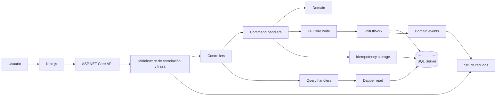
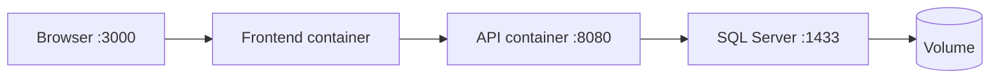

# Guía teórica y aplicada de la prueba técnica .NET

## Sistema de Gestión del Mundialito de Fútbol Corporativo

**Propósito del documento.** Esta guía explica qué significa cada requisito solicitado, qué problema técnico intenta descubrir y cómo fue aplicado en el sistema desarrollado. Está pensada como material de estudio para la defensa técnica.


## 1. Qué busca evaluar realmente la prueba

Los requisitos forman una cadena:

```text
Necesidad funcional
  -> caso de uso
  -> regla de dominio
  -> Command o Query
  -> puerto de Application
  -> EF Core o Dapper
  -> SQL Server
  -> respuesta HTTP
  -> interfaz Next.js
  -> logs, trazas y pruebas
```

Cada patrón resuelve una preocupación diferente. Clean Architecture protege las dependencias. CQRS separa lectura de escritura. Unit of Work protege atomicidad. Result hace explícitos los fallos esperados. Idempotencia protege contra reintentos. Observabilidad permite explicar una ejecución. Docker reduce diferencias ambientales. Las pruebas aportan evidencia.


## 2. Clean Architecture

### 2.1 Concepto

Clean Architecture organiza el software para que las reglas de negocio no dependan de frameworks, bases de datos, HTTP o interfaces gráficas. La dirección de dependencias debe apuntar hacia el núcleo.

No basta con crear carpetas llamadas Domain, Application, Infrastructure y Api. La pregunta decisiva es: **¿qué proyecto conoce a cuál?** Si Domain referencia Entity Framework, deja de ser independiente aunque esté dentro de una carpeta llamada Domain.

### 2.2 Capas implementadas

| Capa | Responsabilidad | Qué no debería contener |
|---|---|---|
| Domain | Entidades, invariantes, Result, errores y eventos | HTTP, EF Core, Dapper, SQL Server, React |
| Application | Casos de uso, Commands/Queries y puertos | Implementaciones SQL, controladores, componentes UI |
| Infrastructure | EF, Dapper, migraciones, repositorios, idempotencia y logging | Decisiones de presentación |
| Api | Adaptación HTTP y composición de dependencias | Reglas del torneo o SQL directo |
| Frontend | Interacción, presentación y proxy | Reglas autoritativas del negocio |

En el sistema, Application define contratos como `IWriteRepository<T>`, `IUnitOfWork`, `IIdempotencyStore` e interfaces de lectura. Infrastructure implementa esos contratos. `Program.cs` conecta interfaces e implementaciones mediante inyección de dependencias.

### 2.4 Inversión de dependencias

La inversión de dependencias significa que la política de alto nivel no depende del detalle de bajo nivel. Application expresa lo que necesita mediante un puerto; Infrastructure decide cómo satisfacerlo.

```text
Application ---> IUnitOfWork <--- Infrastructure.UnitOfWork
Application ---> IMatchReadRepository <--- SqlMatchReadRepository
```

Las flechas representan dependencia del código hacia la abstracción. En ejecución, el contenedor inyecta el objeto concreto.


## 3. Domain-Driven Design ligero: entidades, invariantes y agregados

### 3.1 Entidad

Una entidad mantiene identidad aunque cambien sus atributos. Un equipo sigue siendo el mismo equipo después de cambiar su nombre. `Team`, `Player`, `Match` y `Goal` usan identificadores GUID.
Los setters privados impiden que cualquier consumidor fabrique estados arbitrarios. Métodos como `Create`, `Reschedule`, `AddGoal`, `RegisterResult` o `Cancel` expresan transiciones permitidas.

### 3.2 Invariante

Una invariante es una condición que debe mantenerse después de toda operación válida. Ejemplos del sistema:

- local y visitante deben ser equipos distintos;
- el minuto del gol está entre 1 y 120;
- el goleador debe pertenecer a un equipo participante;
- un partido Played o Cancelled no acepta goles;
- el marcador final coincide con la cantidad de goles por equipo;
- un dorsal permanece reservado dentro del equipo;
- un equipo no puede jugar dos partidos no cancelados el mismo día.

### 3.3 Agregado

Un agregado protege un conjunto de invariantes detrás de una raíz. `Match` coordina participantes, estado, goles y marcador. Para registrar el resultado, Application reconstruye mediante Dapper el estado necesario, Domain comprueba sus reglas y EF persiste los escalares modificados.


## 4. CQRS

### 4.1 Concepto

CQRS significa Command Query Responsibility Segregation. Separa operaciones que cambian estado de operaciones que devuelven información.

- **Command:** expresa una intención y puede modificar estado.
- **Query:** devuelve datos y no modifica el estado observable del negocio.

CQRS no obliga a usar dos bases, microservicios, colas, MediatR ni event sourcing. En esta solución, ambos lados comparten SQL Server, pero usan modelos y tecnologías distintas.

### 4.2 Implementación

```text
Write side:
HTTP -> Controller -> Command handler -> Domain -> EF Core -> UnitOfWork -> SQL

Read side:
HTTP -> Controller -> Query handler -> Dapper -> SQL -> DTO paginado
```

Los Commands pueden consultar datos para validar una decisión. Esas consultas usan Dapper. La clasificación como Command depende de que el caso de uso intenta cambiar estado, no de que nunca lea.

Los handlers son clases explícitas y no requieren un mediator externo. La API los recibe por inyección y traduce sus resultados a HTTP.

### 4.3 DTO y entidad no son lo mismo

Un DTO de partido puede contener `HomeTeamName`, `AwayTeamName` y `GoalCount`. Es una proyección conveniente para mostrar datos. Una entidad `Match` conserva comportamiento e invariantes. Usar una sola clase para ambas funciones acoplaría dominio, persistencia y contrato HTTP.

## 5. Entity Framework Core para escritura

### 5.1 Concepto

EF Core es un Object-Relational Mapper. Mantiene un Change Tracker, traduce cambios de objetos a SQL y mapea relaciones y restricciones.

El requisito restringe EF al write side para demostrar que el candidato comprende tanto un ORM de alto nivel como SQL explícito para lectura.

### 5.3 Implementación aplicada

Los repositorios de escritura preparan `Add`, `Update` o `Remove`. No confirman cambios. Las configuraciones EF definen longitudes, índices, relaciones y comportamiento compatible con triggers.

El sistema usa migraciones para:

- esquema inicial;
- tabla de respuestas idempotentes;
- seed del torneo;
- índices únicos y reglas QA;
- trigger de conflicto de calendario.

La tabla Matches tiene un trigger. EF desactiva una variante de `OUTPUT` incompatible con tablas que tienen triggers. Este detalle muestra que persistencia no es simplemente llamar `SaveChanges`.

### 5.4 Tracking y reconstrucción

Las consultas de negocio no materializan entidades con EF. Cuando un Command necesita cambiar una entidad existente, Dapper aporta un snapshot y un método `Restore` reconstruye un objeto válido sin emitir un evento de creación. Luego EF adjunta/marca la entidad para actualizarla.

## 6. Dapper para lectura

### 6.1 Concepto

Dapper es un micro-ORM: ejecuta SQL y mapea filas a objetos, sin Change Tracker. Da control explícito sobre joins, agregados, CTE, ventanas y páginas.

### 6.2 Objetivo del requisito

El evaluador quiere ver SQL real, consultas parametrizadas y proyecciones diseñadas para el consumidor, sin cargar grafos de entidades ni realizar agregados en memoria.

### 6.3 Implementación

Los repositorios SQL devuelven DTOs y páginas. La tabla de posiciones usa:

- una CTE para representar cada partido desde ambos equipos;
- `LEFT JOIN` para incluir equipos sin partidos;
- agregados para jugados, victorias, empates, derrotas, GF, GC y puntos;
- `ROW_NUMBER` para posición;
- `OFFSET/FETCH` para limitar la página;
- `QueryMultiple` para obtener total y datos en un comando.

La consulta de goleadores considera únicamente goles de partidos Played y conserva estadísticas históricas de jugadores inactivos.

### 6.4 Seguridad SQL

Filtros, IDs, offsets y tamaños son parámetros. `ORDER BY` no acepta un parámetro de columna en SQL, por lo que Application convierte texto a enums e Infrastructure elige fragmentos de una lista permitida.

```text
Entrada "points" -> enum StandingSortField.Points
enum -> fragmento fijo "Points DESC, GoalDifference DESC, ..."
```

La búsqueda literal escapa `%`, `_` y `[` antes de usar LIKE. Así, buscar `%` no significa “cualquier texto”.

### 6.5 Optimización responsable

SQL explícito no es sinónimo automático de rendimiento. La solución evita cargar colecciones completas y reduce viajes, pero no incorpora benchmark ni prueba de volumen. Un patrón `%texto%` puede producir escaneo. Para optimizar de verdad habría que observar planes, índices, cardinalidad y latencia reales.

---

## 7. Unit of Work y transacciones

### 7.1 Concepto

Unit of Work reúne cambios que deben confirmarse como una sola unidad. La propiedad buscada es atomicidad: todos se confirman o ninguno.

### 7.2 Objetivo del requisito

- evitar commits parciales;
- coordinar varios repositorios;
- centralizar transacción y rollback;
- impedir `SaveChanges` disperso;
- hacer visible el punto de confirmación.

### 7.3 Flujo implementado

```text
1. Command prepara cambios en uno o más repositorios.
2. UnitOfWork captura entidades y eventos pendientes.
3. Abre transacción.
4. Ejecuta un SaveChanges controlado.
5. Confirma la transacción.
6. Acepta cambios.
7. Despacha eventos confirmados.
8. Limpia eventos.
```

En un error reconocido de persistencia, se hace rollback, se limpia tracking y se traduce la restricción a un Result. En un error técnico desconocido también se revierte, pero la excepción se propaga.

### 7.4 Ejemplo de consistencia

Crear un equipo nuevo prepara dos filas:

- `Team`;
- `IdempotencyRecord` con estado/cuerpo originales.

Ambas se confirman juntas. Si una falla, no debe quedar un equipo sin replay ni un replay que apunte a un equipo inexistente.

### 7.5 Matices

- DbContext ya se parece a Unit of Work, pero el puerto evita exponer EF a Application y añade traducción/eventos.
- Consultas Dapper previas al commit no están necesariamente dentro de la misma transacción.
- Las restricciones SQL son necesarias para carreras.
- Un fallo al loggear un evento después del commit no puede deshacer el hecho confirmado.
- Migraciones y seed son bootstrap de Infrastructure, no Commands de negocio.

---

## 8. Result Pattern

### 8.1 Concepto

`Result` representa éxito o fallo esperado sin usar excepciones como control normal. `Result<T>` añade un valor de éxito.

```csharp
var creation = Team.Create(name, shortName);
if (creation.IsFailure)
    return Result<CreateTeamOutcome>.Failure(creation.Error!);

var team = creation.Value;
```

Acceder a `Value` sobre un fallo es un error de programación y lanza excepción. El consumidor debe comprobar `IsSuccess`.

### 8.2 Objetivo del requisito

- contratos de fallo explícitos;
- flujo legible;
- códigos estables para clientes;
- separación entre fallos esperados y fallos técnicos;
- mapeo uniforme a HTTP.

### 8.3 Categorías implementadas

| Tipo | HTTP | Ejemplo |
|---|---:|---|
| Validation | 400 | página 0, clave ausente, minuto inválido |
| NotFound | 404 | equipo o partido inexistente |
| Conflict | 409 | dorsal ocupado, marcador incoherente, fecha ocupada |

Los éxitos se traducen a 200, 201 o 204 según la operación.

### 8.4 Qué no debe hacerse

- capturar toda excepción y convertirla en 400;
- lanzar excepciones para nombre vacío;
- ocultar un fallo de infraestructura como conflicto;
- devolver siempre 200 con `{ success:false }`;
- exponer stack traces al cliente.

Model binding de ASP.NET puede producir ProblemDetails antes de llegar al handler. Por eso el frontend acepta tanto el Error de negocio como errores de validación HTTP estándar.

---

## 9. REST completo

### 9.1 Concepto

REST orienta el contrato alrededor de recursos y semántica HTTP. No significa simplemente “JSON por HTTP”.

| Verbo | Intención | Aplicación |
|---|---|---|
| GET | leer sin cambiar estado | detalle, colecciones y estadísticas |
| POST | crear un nuevo recurso/subrecurso | equipos, jugadores, partidos, goles |
| PUT | reemplazar representación editable | equipo, jugador, partido, resultado |
| PATCH | modificar campos suministrados | nombre, dorsal, actividad, calendario |
| DELETE | eliminar o aplicar baja idempotente | equipo, desactivar jugador, cancelar partido |

### 9.2 Objetivo del requisito

- contratos previsibles;
- uso correcto de estados;
- semántica de reintentos;
- separación entre recurso y acción;
- interoperabilidad con clientes, proxies y herramientas.

### 9.3 Estados importantes

- 200: consulta o actualización con cuerpo.
- 201: creación; `Location` informa dirección del recurso.
- 204: operación correcta sin cuerpo.
- 400: solicitud inválida.
- 404: recurso inexistente.
- 409: estado actual impide la operación.

### 9.4 PUT, PATCH y DELETE en este sistema

PUT reemplaza los campos editables del recurso, no necesariamente todas sus columnas internas. La pertenencia del jugador permanece inmutable.

PATCH usa DTO de propiedades opcionales; no implementa JSON Patch RFC 6902. Un objeto vacío se rechaza.

DELETE de jugador es baja lógica para conservar goles. DELETE de partido cancela para preservar historial. DELETE de equipo puede ser físico y fallar si hay relaciones.

Idempotencia del efecto no exige siempre respuesta idéntica. Repetir cancelación no vuelve a cambiar el estado; una repetición puede devolver una respuesta diferente según el contrato. El PUT de resultado finaliza una vez y luego devuelve conflicto, no replay 200.

### 9.5 Interpretación de “todos los GET”

La paginación tiene sentido en colecciones. Un GET de detalle retorna un recurso. Health y Swagger no son colecciones de negocio. Esta interpretación debe explicarse porque la redacción literal de la rúbrica puede prestarse a discusión.

---

## 10. Idempotencia

### 10.1 Concepto

Una operación idempotente puede repetirse sin producir efectos adicionales diferentes. Es crucial cuando el cliente no sabe si una respuesta se perdió después de que el servidor confirmó la escritura.

Ejemplo: el cliente envía crear equipo, el servidor confirma, pero la red se corta antes de devolver 201. Sin idempotencia, reintentar puede duplicar el equipo.

### 10.2 Objetivo del requisito

- tolerancia a fallos de red;
- prevención de duplicados;
- comprensión de concurrencia;
- persistencia del resultado, no memoria local;
- conflictos explícitos cuando una clave cambia de intención.

### 10.3 Algoritmo implementado

```text
Cliente -> POST + Idempotency-Key + payload
Servidor:
  valida clave
  calcula SHA-256 del payload definido
  busca (operación, clave)
  si existe y hash coincide -> reproduce estado y cuerpo
  si existe y hash difiere -> 409
  si no existe -> prepara recurso + respuesta
  UnitOfWork confirma ambos
```

Se guarda operación, clave, hash, status code, body, resource ID y fecha. La operación forma parte de la identidad para evitar colisiones entre endpoints.

### 10.4 Concurrencia

Dos solicitudes con la misma clave pueden leer “no existe”. Una restricción única permite solo una ganadora. La perdedora revierte y lee la respuesta ya confirmada. La consulta previa por sí sola no resolvería la carrera.

### 10.5 Límites

- no hay expiración ni purga;
- el hash no cifra ni autentica;
- la canonicalización depende de cada handler;
- no se implementa replay para cada PUT;
- no reemplaza unicidad de negocio;
- una clave nueva con nombre duplicado puede dar conflicto de identidad.

El frontend conserva la clave al reintentar la misma intención y genera otra cuando el usuario cambia datos o inicia una creación distinta.

---

## 11. Observabilidad y trazabilidad

### 11.1 Concepto

Observabilidad es la capacidad de comprender el estado interno a partir de señales externas. Logging, tracing y métricas son pilares habituales. Esta prueba exige logs y trazas; métricas y OpenTelemetry son opcionales.

### 11.2 Logging estructurado

Un log estructurado conserva campos, no solo una frase concatenada.

```text
Method=GET
Path=/api/matches
StatusCode=200
ElapsedMilliseconds=18.7
CorrelationId=...
TraceId=...
```

Esto permite filtrar y agrupar. `ILogger` usa plantillas y el proveedor de consola produce JSON con scopes y UTC.

### 11.3 Niveles

| Nivel | Uso |
|---|---|
| Debug | inicio detallado de solicitud |
| Information | finalización exitosa y eventos confirmados |
| Warning | respuestas 4xx esperables pero relevantes |
| Error | 5xx y excepciones no controladas |

No todo 404 es Error del proceso; puede ser un resultado del cliente. Elegir nivel ayuda a no generar alertas inútiles.

### 11.4 CorrelationId y TraceId

- **CorrelationId:** identifica la intención del cliente; puede cruzar reintentos o sistemas según la estrategia.
- **TraceId:** identidad técnica W3C de una ejecución distribuida.
- **SpanId:** identifica un tramo dentro de la traza.

No deben confundirse. El middleware acepta/genera X-Correlation-ID y conserva la Activity W3C recibida por `traceparent`. Devuelve X-Correlation-ID y X-Trace-ID. Next.js transmite `traceparent` y `tracestate` a la API.

El middleware mide duración con `Stopwatch`, apropiado para intervalos monotónicos, y mantiene ambos IDs en un scope.

### 11.5 Seguridad de logs

No se registran contraseñas ni cuerpos desde el middleware. Deben evitarse tokens, cookies, cadenas de conexión y datos personales. Un evento puede incluir nombres de equipos como dato de negocio; cualquier expansión futura debe revisar clasificación y retención.

### 11.6 Alcance real

No hay collector OpenTelemetry, Jaeger, Zipkin, métricas ni alertas. El sistema propaga IDs y escribe logs estructurados. Decir “tracing completo distribuido” sería exagerado.

---

## 12. Eventos de dominio

### 12.1 Concepto

Un evento de dominio representa un hecho relevante ocurrido: `TeamCreatedEvent` o `MatchResultRegisteredEvent`. Se nombra en pasado porque describe algo que ya sucedió.

### 12.2 Objetivo del requisito

- modelar hechos relevantes sin acoplar la entidad al logger;
- mantener trazabilidad de cambios importantes;
- comprobar secuencia respecto de transacciones;
- preparar extensibilidad futura.

### 12.3 Implementación

La entidad agrega el evento durante una transición válida. UnitOfWork captura eventos, confirma SQL y luego llama al dispatcher. El dispatcher los registra con TraceId. Finalmente se limpian para evitar repetición en otro commit.

### 12.4 Por qué después del commit

Si se registra “resultado finalizado” antes de confirmar y SQL falla, el log mentiría. Después del commit, el evento representa un hecho persistido.

### 12.5 Límite: no hay outbox

Si el proceso cae después del commit y antes del despacho, puede perderse el log. Una outbox guardaría evento y estado juntos y permitiría reintento. No fue requerida, por lo que la solución prioriza modelación y logging, no entrega garantizada.

---

## 13. Requisitos funcionales

### 13.1 Equipos

Objetivo: administrar participantes y demostrar CRUD, unicidad, páginas y errores.

Implementación:

- crear con nombre y abreviatura;
- listar con búsqueda, orden y página;
- detalle por ID;
- PUT y PATCH;
- DELETE sujeto a relaciones;
- índices únicos para nombre y abreviatura;
- evento de creación;
- POST idempotente.

Caso: una repetición con misma clave/payload retorna la respuesta original. Misma clave con otro payload produce 409.

### 13.2 Jugadores

Objetivo: modelar pertenencia, reglas por equipo e historial.

Implementación:

- registro en equipo existente;
- nombre y dorsal;
- dorsal único por equipo;
- filtros por equipo/actividad;
- baja lógica y reactivación;
- pertenencia inmutable;
- POST idempotente.

La baja lógica conserva goles y estadísticas. El dorsal continúa reservado para evitar ambigüedad histórica.

### 13.3 Partidos

Objetivo: modelar calendario con estados y conflictos.

Implementación:

- Scheduled al crear;
- equipos distintos y existentes;
- filtro por fecha, equipo y estado;
- PUT/PATCH mientras sea Scheduled;
- cancelación lógica;
- regla de un partido por equipo/día;
- trigger SQL para carreras;
- POST idempotente.

Cancelar libera el día, pero conserva la fila. Played no puede cancelarse.

### 13.4 Goles y resultado

Objetivo: mantener coherencia entre hechos detallados y marcador.

Implementación:

- gol con jugador activo participante y minuto 1..120;
- POST de gol idempotente;
- lista paginada de goles;
- resultado solo si conteos coinciden;
- transición a Played;
- evento de resultado;
- bloqueo de cambios posteriores.

Un 0-0 sin goles es válido. Un marcador 1-0 con cero goles se rechaza.

### 13.5 Tabla y goleadores

Solo partidos Played alimentan estadísticas.

```text
Puntos = 3 * victorias + empates
Diferencia = goles a favor - goles en contra
Orden oficial = puntos DESC, diferencia DESC, GF DESC, nombre/ID
```

Ejemplo: victoria 2-1 y empate 0-0 producen PJ 2, PG 1, PE 1, PP 0, GF 2, GC 1, DG +1 y 4 puntos.

Goleadores agrupa por jugador/equipo. Goles de Scheduled no son oficiales todavía. Un jugador inactivo conserva goles históricos.

---

## 14. Filtros, ordenamiento y paginación

### 14.1 Objetivo

Evitar que el servidor lea toda una tabla y recorte después. El evaluador busca paginación real en SQL, totales correctos, validación y orden estable.

### 14.2 Contrato

```json
{
  "data": [],
  "pageNumber": 1,
  "pageSize": 10,
  "totalRecords": 50,
  "totalPages": 5
}
```

Página inicia en 1; tamaño permitido 1..100.

```text
offset = (pageNumber - 1) * pageSize
totalPages = ceiling(totalRecords / pageSize)
```

### 14.3 Orden determinista

Si dos filas tienen el mismo nombre o minuto, SQL no garantiza orden entre ellas. Se agrega ID como desempate. Esto reduce repeticiones/saltos causados por ambigüedad, aunque inserciones concurrentes todavía pueden desplazar filas con paginación por offset.

### 14.4 Marcador independiente de filtros

La página de goles contiene `homeGoals` y `awayGoals` de todo el partido. Filtrar solo goles del local no debe convertir 2-1 en 2-0. `totalRecords`, en cambio, describe filas que cumplen el filtro.

### 14.5 Límites

- offset puede degradarse en páginas muy profundas;
- no hay keyset pagination;
- no hay snapshot entre solicitudes;
- buscar `%texto%` puede escanear;
- `position` se calcula sobre selección filtrada, no necesariamente ranking global.

---

## 15. Seed automático

### 15.1 Concepto y objetivo

Seed es un conjunto reproducible de datos iniciales. Permite evaluar el sistema inmediatamente y demuestra automatización de infraestructura.

La rúbrica exige cuatro equipos, cinco jugadores por equipo, seis partidos y tres resultados, dentro de Infrastructure y compatible con Docker.

### 15.2 Implementación

`TournamentDatabaseInitializer` aplica migraciones. Si no existen equipos, reutiliza las operaciones SQL de la migración de seed dentro de una transacción. El seed usa IDs conocidos e inserciones protegidas para evitar duplicación.

### 15.3 Idempotencia de inicialización

Reiniciar una base ya poblada no duplica equipos. Sin embargo, si existe cualquier equipo, el initializer no repara automáticamente un seed parcialmente eliminado. Es inicialización, no reconciliador.

### 15.4 Concurrencia de despliegue

En Compose hay una API, por lo que el riesgo es reducido. Con múltiples réplicas, convendría ejecutar migraciones desde un job único o mecanismo coordinado. No se promete coordinación distribuida.

---

## 16. Frontend desacoplado con Next.js

### 16.1 Objetivo del requisito

Demostrar que la API es consumible desde otra tecnología, que el cliente maneja páginas/errores y que la lógica autoritativa no vive en la interfaz.

### 16.2 Implementación

Next.js App Router organiza rutas y Route Handler. React gestiona formularios, filtros, página, loading, errores y resultados. TypeScript modela DTOs en compilación.

El navegador llama `/api/backend/...`. El Route Handler del servidor reenvía a `API_BASE_URL`. Así la dirección privada `http://api:8080` no se expone al navegador y se mantiene mismo origen.

### 16.3 Responsabilidades del cliente

- generar CorrelationId;
- enviar Idempotency-Key cuando corresponde;
- mostrar errores de negocio y ProblemDetails;
- soportar 204 sin JSON;
- conservar clave al reintentar la misma intención;
- paginar y filtrar;
- evitar que una respuesta antigua sobrescriba una nueva.

### 16.4 Qué no hace

- no decide si un gol es válido;
- no calcula clasificación oficial;
- no autentica usuarios;
- no reemplaza validación API;
- no incorpora test E2E de toda la navegación.

---

## 17. Docker y Docker Compose

### 17.1 Conceptos

- **Imagen:** paquete inmutable de aplicación y dependencias.
- **Contenedor:** instancia ejecutándose de una imagen.
- **Volumen:** almacenamiento persistente fuera del ciclo del contenedor.
- **Red:** espacio de comunicación entre servicios.
- **Healthcheck:** comprobación periódica usada para conocer disponibilidad básica.

### 17.2 Objetivo del requisito

- ejecución reproducible;
- aislamiento;
- dependencias documentadas;
- menor “funciona en mi máquina”;
- demostración fácil para el examinador.

### 17.3 Implementación

Compose define:

- SQL Server 2022 con volumen;
- API .NET con conexión interna;
- frontend Next.js standalone;
- red privada;
- puertos configurables;
- healthchecks;
- dependencias condicionadas por salud.

Los Dockerfiles son multi-stage: una etapa compila y otra contiene runtime. Las imágenes finales ejecutan usuarios sin privilegios.

### 17.4 Configuración y secretos

`.env` y `.env.docker` están ignorados. `Start-Qa.ps1` reutiliza configuración local o genera una contraseña. Nunca debe publicarse la contraseña ni copiarse a documentación.

### 17.5 Healthcheck no equivale a QA

SQL healthy significa que acepta consulta básica. API healthy significa que `/health` responde. Frontend healthy significa que entrega la portada. Nada de esto demuestra por sí solo que idempotencia o clasificación sean correctas.

Configuración Developer, `sa`, HTTP interno y `TrustServerCertificate=True` son apropiados para demostración local, no para producción.

---

## 18. Diagrama de arquitectura

### 18.1 Objetivo

Un diagrama comunica límites y flujo antes de leer código. La rúbrica exige capas, CQRS, EF, Dapper, UnitOfWork, idempotencia, eventos, logs, traza, frontend y Docker.

### 18.2 Diagrama conceptual





La primera vista explica software; la segunda despliegue. Mezclarlas sin distinguir puede hacer el diagrama ilegible.

---

## 19. Postman y pruebas de contrato manuales

### 19.1 Objetivo

Postman ofrece una demostración reproducible sin depender de la UI. Variables permiten reutilizar IDs; scripts comprueban estados, headers e invariantes.

### 19.2 Colección implementada

Incluye health, equipos, jugadores, partidos, goles, resultado, posiciones y goleadores. Prueba:

- replay idempotente;
- filtros y páginas;
- conflictos;
- CorrelationId y TraceId;
- marcador paginado;
- protección de historial.

Newman ejecuta la colección desde CLI y devuelve código de salida automatizable. La evidencia histórica fue 27 solicitudes y 110 aserciones.

### 19.3 Precauciones

La colección crea datos. Genera un runId y fechas futuras para reducir colisiones, pero usa la base configurada. Debe ejecutarse en QA, no contra producción. Que Newman pase no sustituye pruebas unitarias ni inspección de concurrencia.

---

## 20. Pruebas automatizadas

### 20.1 Pirámide conceptual

| Tipo | Qué valida | Coste/velocidad |
|---|---|---|
| Unitaria | una regla o clase aislada | baja / rápida |
| Integración | colaboración con DB/framework | mayor / más lenta |
| Contrato/API | rutas, estados y esquema HTTP | media |
| End-to-end | recorrido desde interfaz a DB | alta / lenta |

No son sustitutos perfectos. Una prueba SQL real puede validar mejor una consulta, pero no cumple nominalmente un requisito que pide una prueba unitaria del cálculo.

### 20.2 Implementación existente

- Domain: entidades, reglas y Result.
- Application: handlers y validaciones con dobles.
- Infrastructure: SQLite, UnitOfWork, migraciones y SQL Server real.
- API: OpenAPI, health y middleware.
- Newman: escenario HTTP real.

### 20.3 Fixture SQL seguro

Las pruebas reales usan una base `DotNetTestMundial_QA_<GUID>`, aplican migraciones, escriben con EF/UnitOfWork, consultan con Dapper y eliminan únicamente esa base. Una expresión regular impide limpiar un nombre inesperado.

### 20.4 Evidencia y deuda

Existe una ejecución histórica completa con 211 tests .NET aprobados. Una repetición posterior aprobó Domain 57, Infrastructure 37 y API 10, pero Windows Code Integrity bloqueó Application. El runner produjo un TRX con cero tests aunque el proceso podía devolver éxito.

`Test-Qa.ps1` ahora exige cuatro TRX, total mayor que cero y `passed == total`. Así un falso verde falla.

La deuda aceptada:

- repetir Application en ambiente autorizado;
- cerrar QA integral del estado final;
- cubrir nominalmente como unitarias puras posiciones, puntos y diferencia si se exige lectura estricta.

No se deben eliminar tests, desactivar CI ni afirmar 100% de validación.

---

## 21. Integración continua

### 21.1 Concepto

CI ejecuta validaciones automáticamente ante push o pull request. Reduce diferencias entre desarrolladores y aporta evidencia independiente del equipo local.

### 21.2 Pipeline

La workflow de QA en Ubuntu realiza:

1. checkout;
2. setup .NET;
3. restore, format y tests;
4. setup pnpm/Node;
5. install, lint y build frontend;
6. validar/build Compose;
7. levantar servicios;
8. pruebas SQL reales;
9. Newman;
10. logs si falla;
11. limpieza de volumen efímero.

Crear un PR no significa que CI pasó. Hacer merge sin revisar checks, deuda y aprobación es una decisión de proceso, no una consecuencia técnica automática.

---

## 22. Casos de uso explicados

### 22.1 Inscribir equipo con reintento

**Actor:** organizador.  
**Precondición:** nombre/abreviatura no usados.  
**Flujo:** POST con clave -> Domain valida -> Dapper busca clave/identidad -> EF prepara equipo+respuesta -> UnitOfWork confirma -> 201.  
**Reintento:** misma clave/payload -> Dapper recupera respuesta -> mismo ID, sin commit.  
**Alterno:** misma clave/otro payload -> 409.

Objetivo técnico: demostrar idempotencia, concurrencia, atomicidad y estados HTTP.

### 22.2 Programar partido

**Actor:** organizador.  
**Precondición:** equipos existentes, distintos y libres ese día.  
**Flujo:** Command consulta -> Domain crea Scheduled -> EF prepara -> UnitOfWork confirma.  
**Carrera:** trigger SQL impide dos partidos simultáneamente validados.

Objetivo técnico: regla de calendario protegida en Domain/Application/SQL.

### 22.3 Registrar gol y cerrar resultado

**Actor:** responsable del encuentro.  
**Precondición:** partido Scheduled; jugador activo y participante.  
**Flujo gol:** POST idempotente -> gol persistido.  
**Flujo resultado:** Dapper reconstruye partido+goles -> Domain compara marcador -> EF actualiza -> evento posterior al commit.

Objetivo técnico: coherencia entre detalle y agregado, eventos y estadísticas derivadas.

### 22.4 Consultar posiciones

**Actor:** usuario de consulta.  
**Precondición:** ninguna.  
**Flujo:** Query valida página/orden -> Dapper ejecuta CTE/agregados -> DTO paginado.  
**Regla:** solo Played; equipos sin partidos aparecen con cero.

Objetivo técnico: SQL optimizado, ranking, filtros y paginación.

### 22.5 Diagnosticar una solicitud

**Actor:** soporte/desarrollador.  
**Flujo:** cliente envía CorrelationId y traceparent -> proxy conserva -> middleware crea scope -> handlers/eventos loggean en la misma traza -> respuesta devuelve IDs.

Objetivo técnico: reconstruir el recorrido sin registrar contenido sensible.

---

## 23. Ejemplos HTTP/PowerShell

Los ejemplos modifican la base local. Deben usarse en un ambiente de demostración con claves únicas.

```powershell
$api = 'http://localhost:5164'
$run = [Guid]::NewGuid().ToString('N')
$headers = @{
  'Idempotency-Key' = "team-$run"
  'X-Correlation-ID' = "defensa-$run"
}
$body = @{
  name = "Equipo Defensa $run"
  shortName = ('D' + $run.Substring(0,7))
} | ConvertTo-Json

$first = Invoke-RestMethod "$api/api/teams" -Method Post `
  -Headers $headers -ContentType 'application/json' -Body $body
$replay = Invoke-RestMethod "$api/api/teams" -Method Post `
  -Headers $headers -ContentType 'application/json' -Body $body
$first.id -eq $replay.id
```

Página de posiciones:

```powershell
Invoke-RestMethod "$api/api/standings?pageNumber=1&pageSize=10&sortBy=points&sortDirection=desc"
```

Página de goles del seed sin alterar marcador completo:

```powershell
$matchId = '26500000-0000-0000-0000-000000000001'
Invoke-RestMethod "$api/api/matches/$matchId/goals?pageNumber=2&pageSize=1&sortBy=minute&sortDirection=asc"
```

Trazabilidad a través del proxy:

```powershell
$trace = @{
  'X-Correlation-ID' = 'defensa-trace'
  traceparent = '00-1234567890abcdef1234567890abcdef-1234567890abcdef-01'
}
$response = Invoke-WebRequest "http://localhost:3000/api/backend/api/standings?pageNumber=1&pageSize=2" -Headers $trace
$response.Headers['X-Correlation-ID']
$response.Headers['X-Trace-ID']
```

Arranque:

```powershell
.\scripts\Start-Qa.ps1
docker compose ps
```

No use `docker compose down --volumes` salvo que pretenda eliminar la base local.

---

## 24. Preguntas probables de defensa

### ¿Por qué EF Core y Dapper?

Porque cumplen necesidades distintas y la prueba lo exige. EF coordina cambios y relaciones; Dapper permite SQL/proyecciones explícitas. El coste es mantener ambos modelos.

### ¿DbContext no es ya Unit of Work?

Conceptualmente se parece. El puerto propio evita exponer EF a Application y centraliza transacción, traducción de errores y eventos posteriores.

### ¿Por qué validar también en SQL?

Porque una consulta previa puede perder una carrera. Índices y triggers son la última defensa ante concurrencia o clientes externos.

### ¿Por qué no guardar la tabla de posiciones?

Es información derivada de Played. Calcularla evita sincronizar dos estados. Con volumen mayor podría evaluarse una proyección materializada, basada en medición.

### ¿POST idempotente significa que PUT resultado también reproduce 200?

No. POST implementa replay persistido explícito. PUT resultado conserva el efecto porque no vuelve a cambiar Played, pero responde conflicto según el estado actual.

### ¿Eventos garantizados?

No. Se loggean después del commit; sin outbox una caída puede perder la observación. La consistencia SQL sí quedó confirmada.

### ¿Hay tracing distribuido completo?

Hay Activity W3C, propagación y logs enlazados. No hay collector OpenTelemetry ni visualización Jaeger/Zipkin.

### ¿Por qué jugador se desactiva?

Para preservar goles e historial. Borrarlo físicamente complicaría integridad y estadísticas.

### ¿Qué pasa con concurrencia de actualizaciones?

Índices/triggers protegen reglas concretas. No existe rowversion general, por lo que última escritura puede ganar en ciertos updates válidos.

### ¿Está terminado QA?

No. Se pospuso una repetición bloqueada por Windows y el cierre integral. Debe explicarse sin convertir evidencia histórica en una certificación actual.

---

## 25. Mejoras razonables para producción

No forman parte del alcance entregado, pero muestran criterio:

1. autenticación y autorización por roles;
2. TLS válido y gestión de secretos;
3. usuario SQL de mínimo privilegio;
4. rowversion para concurrencia optimista;
5. outbox y consumidor reintentable;
6. OpenTelemetry, métricas y collector;
7. expiración/purga de claves idempotentes;
8. rate limiting y límites de payload;
9. pruebas E2E del frontend;
10. pruebas de carga y planes SQL;
11. backups y recuperación;
12. migraciones coordinadas en despliegue;
13. ranking global separado de filtros si el negocio lo exige;
14. cursor pagination para páginas profundas;
15. soporte multi-torneo si cambia el dominio.

Una defensa madura distingue entre “faltante obligatorio”, “limitación aceptada” y “mejora futura”. No debe prometer producción empresarial con una prueba técnica de 48-72 horas.

---

## 26. Glosario

| Término | Definición breve |
|---|---|
| Acoplamiento | grado en que un componente conoce detalles de otro |
| Agregado | conjunto de entidades protegido por una raíz y sus invariantes |
| Atomicidad | todos los cambios se confirman o ninguno |
| CTE | expresión SQL temporal nombrada dentro de una consulta |
| Command | intención de modificar estado |
| CorrelationId | identificador lógico para relacionar operaciones/logs |
| CQRS | separación entre responsabilidades de escritura y lectura |
| DTO | objeto diseñado para transportar/proyectar datos |
| Entidad | objeto con identidad persistente |
| Event sourcing | modelo donde eventos son la fuente del estado; no se usa aquí |
| Healthcheck | comprobación básica de disponibilidad de un servicio |
| Idempotencia | repetición sin efectos adicionales diferentes |
| Invariante | condición que debe conservarse en estados válidos |
| Middleware | componente que envuelve el pipeline HTTP |
| Migración | cambio versionado del esquema/datos iniciales |
| ORM | mapeo entre objetos y base relacional |
| Outbox | patrón para persistir mensajes con la transacción de negocio |
| Query | operación de lectura sin cambio de negocio |
| Replay | devolución de una respuesta persistida ante reintento |
| Result Pattern | éxito/fallo esperado como valor explícito |
| Scope de log | contexto añadido a múltiples logs relacionados |
| Seed | datos iniciales reproducibles |
| SpanId | identidad de un tramo de una traza |
| TraceId | identidad técnica de una traza distribuida |
| Transacción | frontera de confirmación/rollback de cambios |
| Unit of Work | coordinación del conjunto de cambios a confirmar |

---

## 27. Guion sugerido de exposición

1. **Problema y alcance (1 minuto):** equipos, jugadores, calendario, goles, resultados y estadísticas.
2. **Arquitectura (3 minutos):** dirección de dependencias, CQRS y por qué EF/Dapper.
3. **Consistencia (3 minutos):** Domain, UnitOfWork, restricciones e idempotencia.
4. **Consulta (2 minutos):** clasificación SQL y paginación.
5. **Operación (2 minutos):** Docker, seed y observabilidad.
6. **Evidencia (2 minutos):** tests por nivel, Postman y deuda QA.
7. **Límites (1 minuto):** outbox, auth, rowversion y mejoras futuras.

El mejor cierre no es afirmar que todo es perfecto, sino demostrar que cada decisión fue consciente, verificable y proporcional al alcance.

---

## 28. Lista de comprobación para estudiar

- [ ] Puedo dibujar las dependencias entre capas sin mirar el repositorio.
- [ ] Puedo explicar por qué CQRS no implica dos bases.
- [ ] Puedo seguir una creación desde HTTP hasta SQL.
- [ ] Puedo explicar rollback y evento posterior al commit.
- [ ] Puedo diferenciar Error de negocio y excepción técnica.
- [ ] Puedo explicar replay idempotente y carrera por clave.
- [ ] Puedo derivar puntos/diferencia con un ejemplo.
- [ ] Puedo explicar por qué solo Played cuenta.
- [ ] Puedo defender ORDER BY permitido y parámetros SQL.
- [ ] Puedo explicar totalRecords frente a marcador completo.
- [ ] Puedo distinguir CorrelationId de TraceId.
- [ ] Puedo decir qué observabilidad no fue implementada.
- [ ] Puedo explicar por qué healthcheck no es QA.
- [ ] Puedo describir seed y su límite ante base parcialmente poblada.
- [ ] Puedo diferenciar test unitario, integración, contrato y E2E.
- [ ] Puedo declarar la deuda de QA sin ocultarla.
- [ ] Puedo mencionar mejoras futuras sin presentarlas como alcance actual.

---

## 29. Conclusión

La prueba fue diseñada para evaluar razonamiento arquitectónico completo. Los conceptos no son adornos independientes: se conectan para proteger el sistema.

- Clean Architecture define dónde vive cada decisión.
- CQRS distingue intención de cambio y forma de consulta.
- Domain protege reglas.
- EF Core y UnitOfWork confirman cambios consistentes.
- Dapper proyecta datos paginados y agregados.
- Result comunica fallos esperados.
- REST e idempotencia hacen el contrato tolerante a reintentos.
- Observabilidad explica ejecuciones confirmadas.
- Next.js demuestra consumo desacoplado.
- Docker y seed reproducen el entorno.
- Diagramas, Postman y pruebas aportan entendimiento y evidencia.

La implementación cubre el alcance funcional y arquitectónico documentado, con reservas explícitas en el cierre de pruebas. Esa transparencia es parte de una defensa técnica profesional: distinguir claramente entre diseño implementado, evidencia disponible y validación todavía pendiente.
